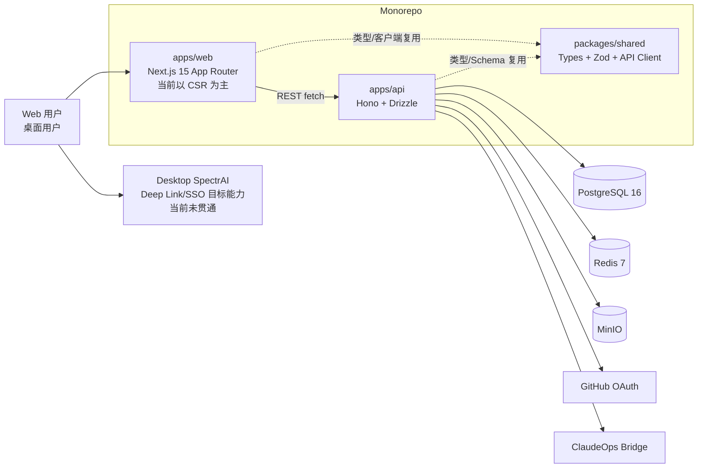
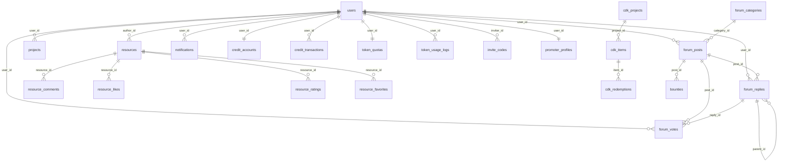

# SpectrAI 社区论坛改造：现状分析总集

> 文档编号：00
> 
> 关联文档：[Linux.do 对标](./01-linuxdo-benchmark.md) · [差距清单](./02-gap-analysis.md) · [路线图](./03-roadmap.md) · [P0 详细方案](./04-p0-detailed-plan.md) · [下一步清单](./05-next-steps.md)
> 
> 证据来源：`docs/community-revamp/raw/raw_frontend.md`、`docs/community-revamp/raw/raw_backend.md`、`README.md`、`docs/spectrai-community-brainstorm.md`、`docs/development-roadmap.md`
> 
> 说明：本报告只做文档整合，不改代码。

---

## 1. 执行摘要（TL;DR）

1. SpectrAI 社区已经具备“可用的资源社区 + 可用的论坛基础 + 可用的后台管理”骨架，但论坛核心体验仍停留在“功能存在、机制未闭环”的状态（`docs/community-revamp/raw/raw_frontend.md:233-252`，`docs/community-revamp/raw/raw_backend.md:522-621`）。
2. 前端最大问题不是“没页面”，而是“关键路径断点”与“系统性工程债”：OAuth 回调失效、图片上传失效、Top 导航信息架构弱、全站 CSR、缺统一状态组件（`docs/community-revamp/raw/raw_frontend.md:219`，`docs/community-revamp/raw/raw_frontend.md:950`，`docs/community-revamp/raw/raw_frontend.md:954`，`docs/community-revamp/raw/raw_frontend.md:529`）。
3. 后端最大问题不是“没 API”，而是“治理与安全底盘不完整”：缺限流、缺举报、缺通知偏好/邮件/实时、缺 trust_level 自动写回、上传校验不足（`docs/community-revamp/raw/raw_backend.md:309`，`docs/community-revamp/raw/raw_backend.md:607`，`docs/community-revamp/raw/raw_backend.md:643`，`docs/community-revamp/raw/raw_backend.md:665`）。

---

## 2. 技术架构总览

### 2.1 架构图（当前态）



### 2.2 文字说明

- Monorepo 结构与技术栈在 README 中定义明确：前端 Next.js、后端 Hono、数据 PostgreSQL + Redis、部署 Docker Compose（`README.md:5-12`，`README.md:60-104`）。
- 前端页面数量与覆盖面已经比较完整，但动态页面几乎全是 `'use client' + useEffect` 拉数据，SSR/ISR 基本没用起来（`docs/community-revamp/raw/raw_frontend.md:219`，`docs/community-revamp/raw/raw_frontend.md:623-627`）。
- 后端路由完整度非常高：27 个路由文件，论坛、资源、用户、通知、后台、积分、CDK、悬赏等都已挂载（`docs/community-revamp/raw/raw_backend.md:133-165`，`docs/community-revamp/raw/raw_backend.md:191-223`）。
- 关键矛盾：前端“交互链路断点”与后端“治理链路断点”叠加，导致用户感知为“能看但不稳、能发但不闭环”。

### 2.3 当前架构成熟度判定

| 维度 | 判定 | 说明 |
|---|---|---|
| 功能覆盖面 | 中高 | 页面和 API 覆盖广（前后端都有） |
| 关键链路可靠性 | 中低 | OAuth、上传、举报、治理闭环缺口明显 |
| 工程规范化 | 中低 | 前端重复代码、构建检查禁用、状态组件不统一 |
| 安全治理 | 低 | 限流缺失、上传校验缺、XSS 防线偏弱 |
| 社区机制 | 低到中 | 论坛可用但信任体系/举报/通知偏好未贯通 |

---

## 3. 代码结构与模块边界

### 3.1 Monorepo 结构（现状）

```text
spectrai-community-brainstorm/
├── apps/
│   ├── web/                      # Next.js 15 前端
│   └── api/                      # Hono 后端
├── packages/
│   └── shared/                   # 类型、Schema、API 客户端
├── docs/
│   ├── community-revamp/
│   │   ├── raw/
│   │   ├── 01-linuxdo-benchmark.md
│   │   └── 本轮交付文档
│   ├── spectrai-community-brainstorm.md
│   └── development-roadmap.md
├── docker-compose.yml
└── README.md
```

### 3.2 apps/web（前端）

- 路由覆盖：登录/注册、论坛、资源、发布、排行榜、用户主页、通知、后台等（`docs/community-revamp/raw/raw_frontend.md:166-206`）。
- 已确认问题：
  - OAuth 回调是 TODO 级别损坏（`docs/community-revamp/raw/raw_frontend.md:252`，`docs/community-revamp/raw/raw_frontend.md:950`）。
  - Header 有 `/user/me` 无效路径（`docs/community-revamp/raw/raw_frontend.md:283`，`docs/community-revamp/raw/raw_frontend.md:1082-1087`）。
  - Markdown 图片上传是 blob URL 假上传（`docs/community-revamp/raw/raw_frontend.md:954-963`）。
  - 论坛详情书签/举报按钮无 onClick（`docs/community-revamp/raw/raw_frontend.md:1004-1021`）。
- UI 工程债：
  - 缺 `@tailwindcss/typography` 但大量使用 `prose`（`docs/community-revamp/raw/raw_frontend.md:44-46`）。
  - 全站缺统一 loading/error/empty 体系（`docs/community-revamp/raw/raw_frontend.md:562`，`docs/community-revamp/raw/raw_frontend.md:573`，`docs/community-revamp/raw/raw_frontend.md:579`）。

### 3.3 apps/api（后端）

- 路由规模：27 个文件，论坛/资源/用户/通知/后台/积分/CDK/悬赏均落地（`docs/community-revamp/raw/raw_backend.md:133-165`）。
- 论坛主链路已实现：分类、帖子、回复、投票、后台置顶/锁帖/分类管理（`docs/community-revamp/raw/raw_backend.md:225-247`）。
- 关键未补：
  - 私信未实现（`docs/community-revamp/raw/raw_backend.md:574-579`）。
  - 举报未实现（`docs/community-revamp/raw/raw_backend.md:607-608`）。
  - 通知偏好/邮件/实时未实现（`docs/community-revamp/raw/raw_backend.md:309`，`docs/community-revamp/raw/raw_backend.md:715-716`）。
  - 限流缺失（`docs/community-revamp/raw/raw_backend.md:643`）。

### 3.4 packages/shared（共享包）

- 目标：统一类型、Schema、API 客户端（`README.md:135-158`）。
- 现状评价：有基础，但前端仍存在 `as any`、`averageRating` 类型绕过、多处重复 `getAuthHeaders/timeAgo`，说明共享包价值未充分发挥（`docs/community-revamp/raw/raw_frontend.md:651-699`，`docs/community-revamp/raw/raw_frontend.md:1036-1049`）。

### 3.5 关键目录与角色归纳

| 目录 | 角色 | 当前状态 |
|---|---|---|
| `apps/web/app` | 页面路由与页面级数据请求 | 路由多、可用性中等、CSR 偏重 |
| `apps/web/components` | UI 与业务组件 | 有亮点，但重复逻辑多 |
| `apps/web/lib` | 前端基础工具层 | 能力薄，公共函数沉淀不足 |
| `apps/api/src/routes` | API 入口层 | 覆盖广，治理/安全补丁待补 |
| `apps/api/src/lib` | 存储/通知/缓存工具 | 有基础，缺安全策略封装 |
| `apps/api/src/db` | schema + seed | 表设计广，部分预留未启用 |
| `packages/shared` | 类型与 schema 复用 | 有框架，执行强度不足 |

---

## 4. 功能完成度矩阵（前后端对照）

> 评分口径：
> 
> - ✅ 已实现：主链路可用，边界问题可接受
> - 🟡 半成品：能用但不完整/关键分支缺失
> - ❌ 未实现：缺核心接口或缺核心页面

| 功能 | 前端完成度 | 后端完成度 | 证据 |
|---|---|---|---|
| 注册登录 | 🟡 登录注册页可用；OAuth 回调损坏 | 🟡 JWT/GitHub/bridge 可用；2FA/refresh 缺失 | `docs/community-revamp/raw/raw_frontend.md:233-234` `docs/community-revamp/raw/raw_frontend.md:252` `docs/community-revamp/raw/raw_backend.md:247-261` |
| 发帖回复 | 🟡 发帖/回帖可用；回复编辑器体验弱 | ✅ 帖子/回复 CRUD 完整 | `docs/community-revamp/raw/raw_frontend.md:239` `docs/community-revamp/raw/raw_frontend.md:412` `docs/community-revamp/raw/raw_backend.md:225-247` |
| 分类标签 | 🟡 分类可见；标签治理弱 | 🟡 分类可用；论坛标签过滤端点缺 | `docs/community-revamp/raw/raw_frontend.md:236-239` `docs/community-revamp/raw/raw_backend.md:556-560` |
| 搜索 | 🟡 Marketplace 局部搜索可用 | 🟡 资源搜索有；论坛独立搜索缺 | `docs/community-revamp/raw/raw_frontend.md:240` `docs/community-revamp/raw/raw_frontend.md:529-531` `docs/community-revamp/raw/raw_backend.md:560` |
| 通知 | 🟢 通知中心可用 | 🟡 站内可用；偏好/邮件/实时缺 | `docs/community-revamp/raw/raw_frontend.md:251` `docs/community-revamp/raw/raw_backend.md:300-311` `docs/community-revamp/raw/raw_backend.md:309` |
| 私信 | ❌ 无前端入口与页面 | ❌ 无表无路由 | `docs/community-revamp/raw/raw_backend.md:574-579` |
| 徽章 | ❌ 无可视化与页面 | ❌ 仅预留表 | `docs/community-revamp/raw/raw_backend.md:588-589` `docs/community-revamp/raw/raw_backend.md:388` |
| 信任等级 | ❌ 前端未形成用户可见成长链路 | 🟡 读取门槛有，自动写回缺失 | `docs/community-revamp/raw/raw_backend.md:273` `docs/community-revamp/raw/raw_backend.md:389` `docs/community-revamp/raw/raw_backend.md:587` |
| 积分 | 🟡 前台露出有限 | ✅ 积分主链路完整 | `docs/community-revamp/raw/raw_backend.md:261-275` `docs/community-revamp/raw/raw_backend.md:581-586` |
| 用户主页 | 🟡 基础资料可见；收藏 tab 占位 | 🟡 用户详情/统计有；编辑 PATCH 缺 | `docs/community-revamp/raw/raw_frontend.md:250` `docs/community-revamp/raw/raw_frontend.md:987-1000` `docs/community-revamp/raw/raw_backend.md:328-334` |
| 关注 | ❌ 前端无关注关系产品化 | ❌ 无 follow 表与路由 | `docs/community-revamp/raw/raw_backend.md:596` |
| 收藏 | 🟡 收藏入口有；个人页收藏不通 | 🟡 收藏 API 有；事务一致性待补 | `docs/community-revamp/raw/raw_frontend.md:1000` `docs/community-revamp/raw/raw_backend.md:599-604` `docs/community-revamp/raw/raw_backend.md:663` |
| 点赞 | 🟡 有按钮与乐观更新 | 🟡 API 有；事务一致性待补 | `docs/community-revamp/raw/raw_frontend.md:415` `docs/community-revamp/raw/raw_backend.md:603-604` `docs/community-revamp/raw/raw_backend.md:664` |
| 举报 | ❌ 帖子举报按钮无 onClick | ❌ 无举报表/路由 | `docs/community-revamp/raw/raw_frontend.md:1004-1021` `docs/community-revamp/raw/raw_backend.md:607-608` |
| 管理后台 | 🟡 页面覆盖较全，部分未深审 | ✅ API 覆盖较广可用 | `docs/community-revamp/raw/raw_frontend.md:256-264` `docs/community-revamp/raw/raw_backend.md:336-350` |
| 上传 | ❌ 前端图片上传是 blob 假上传 | 🟡 预签名+确认可用但校验不足 | `docs/community-revamp/raw/raw_frontend.md:954-963` `docs/community-revamp/raw/raw_backend.md:621-635` `docs/community-revamp/raw/raw_backend.md:665` |

### 4.1 注册登录

- 前端：登录/注册 UI 看起来可用，但 OAuth 回调逻辑实为 TODO，主登录入口可触发失败（`docs/community-revamp/raw/raw_frontend.md:950`）。
- 后端：认证路由齐全，JWT + GitHub + bridge 存在；但 refresh token 生命周期与 2FA 缺失（`docs/community-revamp/raw/raw_backend.md:247-261`）。
- 判断：用户看见“能登录”，但关键路径不稳。

### 4.2 发帖回复

- 前端：发帖页面完成度高于帖子详情页；回复区编辑器能力弱于发帖编辑器（`docs/community-revamp/raw/raw_frontend.md:239`，`docs/community-revamp/raw/raw_frontend.md:412`）。
- 后端：帖子、回复、投票均有 API（`docs/community-revamp/raw/raw_backend.md:225-247`）。
- 判断：业务骨架可用，讨论深度体验不足。

### 4.3 分类与标签

- 前端：有分类路径，标签治理和标签作为二级索引能力不足。
- 后端：分类 API 完整，论坛检索与标签过滤不足（`docs/community-revamp/raw/raw_backend.md:560`）。
- 判断：只有一级目录，没有高效的“主题重组”。

### 4.4 搜索

- 前端：仅 marketplace 内搜索，Header 无全局入口，论坛无搜索（`docs/community-revamp/raw/raw_frontend.md:529-531`）。
- 后端：资源搜索存在，论坛侧缺独立全文搜索端点（`docs/community-revamp/raw/raw_backend.md:560`）。
- 判断：知识复用效率被严重限制。

### 4.5 通知

- 前端：通知中心与铃铛基础可用；轮询策略简单粗暴（`docs/community-revamp/raw/raw_frontend.md:431`）。
- 后端：站内通知 CRUD 有；偏好、邮件、实时推送缺（`docs/community-revamp/raw/raw_backend.md:309`）。
- 判断：有“通知列表”，没有“通知系统”。

### 4.6 私信

- 后端无模型无路由；前端亦无入口（`docs/community-revamp/raw/raw_backend.md:574-579`）。
- 判断：社区协作缺少私域缓冲区。

### 4.7 徽章/信任/积分

- 积分后端较成熟（`docs/community-revamp/raw/raw_backend.md:261-275`）。
- 信任等级写回机制缺失（`docs/community-revamp/raw/raw_backend.md:273`）。
- 徽章仅在表层预留（`docs/community-revamp/raw/raw_backend.md:588-589`）。
- 判断：已有“经济账本”，缺“身份成长系统”。

### 4.8 用户主页与关注

- 用户主页基础展示可用，但收藏 tab 是硬编码空状态（`docs/community-revamp/raw/raw_frontend.md:987-1000`）。
- follow/fans 未落地（`docs/community-revamp/raw/raw_backend.md:596`）。
- 判断：用户档案像“简历页”，不是“社交页”。

### 4.9 收藏/点赞/举报

- 收藏点赞 API 有，但后端事务一致性问题未收敛（`docs/community-revamp/raw/raw_backend.md:663-664`）。
- 举报前后端都未闭环（`docs/community-revamp/raw/raw_frontend.md:1004-1021`，`docs/community-revamp/raw/raw_backend.md:607-608`）。
- 判断：低风险互动可用，高风险治理不可用。

### 4.10 管理后台

- 前端后台页面范围广，部分页面“未深度审查”意味着质量未知（`docs/community-revamp/raw/raw_frontend.md:256-264`）。
- 后端 admin 路由覆盖度高，具备“可运营”雏形（`docs/community-revamp/raw/raw_backend.md:336-350`）。

### 4.11 上传

- 前端：两处组件都在生成 blob URL，不写入可共享存储（`docs/community-revamp/raw/raw_frontend.md:954-963`）。
- 后端：有 `presign/confirm`，但缺 MIME 白名单/大小限制/对象存在校验（`docs/community-revamp/raw/raw_backend.md:621-635`）。
- 判断：上传链路是当前最直观的数据正确性风险。

---

## 5. UI/UX 问题 Top 20（按严重度）

> 证据均来自 `docs/community-revamp/raw/raw_frontend.md`，格式为 `file:line`。

### S1（致命）

1. **OAuth 登录回调完全损坏**
   - 影响：主登录入口可见但不可用，直接阻断新用户进入。
   - 证据：`docs/community-revamp/raw/raw_frontend.md:252`，`docs/community-revamp/raw/raw_frontend.md:950`。

2. **图片上传是假上传（blob URL）**
   - 影响：发布后图片失效，用户感知为“帖子损坏”。
   - 证据：`docs/community-revamp/raw/raw_frontend.md:954`，`docs/community-revamp/raw/raw_frontend.md:963`。

3. **帖子详情书签/举报按钮无行为**
   - 影响：关键互动入口是“死按钮”，信任感崩塌。
   - 证据：`docs/community-revamp/raw/raw_frontend.md:1004`，`docs/community-revamp/raw/raw_frontend.md:1021`。

4. **全站动态内容走 CSR，内容型页面无 SSR**
   - 影响：首屏慢、SEO 弱、长内容阅读体验差。
   - 证据：`docs/community-revamp/raw/raw_frontend.md:219`，`docs/community-revamp/raw/raw_frontend.md:623`。

5. **全局搜索缺失**
   - 影响：历史知识难复用，重复提问成本高。
   - 证据：`docs/community-revamp/raw/raw_frontend.md:529-531`。

### S2（高）

6. **无面包屑导航**
   - 影响：深层页面迷路，高跳出。
   - 证据：`docs/community-revamp/raw/raw_frontend.md:525-526`，`docs/community-revamp/raw/raw_frontend.md:1092`。

7. **用户菜单链接 `/user/me` 无效**
   - 影响：登录后“我的主页”路径错误。
   - 证据：`docs/community-revamp/raw/raw_frontend.md:283`，`docs/community-revamp/raw/raw_frontend.md:1082-1087`。

8. **忘记密码页面实际禁用**
   - 影响：账户恢复路径中断。
   - 证据：`docs/community-revamp/raw/raw_frontend.md:235`，`docs/community-revamp/raw/raw_frontend.md:973`。

9. **用户主页收藏 Tab 永久占位**
   - 影响：用户行为与展示断裂。
   - 证据：`docs/community-revamp/raw/raw_frontend.md:250`，`docs/community-revamp/raw/raw_frontend.md:987-1000`。

10. **通知铃铛 30 秒无条件轮询**
    - 影响：无视可见性状态，增加噪声与负载。
    - 证据：`docs/community-revamp/raw/raw_frontend.md:431`。

11. **构建质量闸门被关闭（TS/ESLint）**
    - 影响：问题进入生产概率上升。
    - 证据：`docs/community-revamp/raw/raw_frontend.md:123`，`docs/community-revamp/raw/raw_frontend.md:126`。

12. **JWT 存 localStorage，认证安全边界弱**
    - 影响：XSS 一旦发生，可直接窃取 token。
    - 证据：`docs/community-revamp/raw/raw_frontend.md:719`。

### S3（中）

13. **`@tailwindcss/typography` 缺失导致 Markdown 排版失真**
    - 影响：长文可读性显著下降。
    - 证据：`docs/community-revamp/raw/raw_frontend.md:44`，`docs/community-revamp/raw/raw_frontend.md:46`，`docs/community-revamp/raw/raw_frontend.md:386`。

14. **手写 Markdown 渲染器安全与维护成本高**
    - 影响：难覆盖语法与 XSS 变体。
    - 证据：`docs/community-revamp/raw/raw_frontend.md:388`，`docs/community-revamp/raw/raw_frontend.md:725-727`。

15. **加载状态只有 spinner+文案，缺 Skeleton**
    - 影响：体感慢，视觉抖动强。
    - 证据：`docs/community-revamp/raw/raw_frontend.md:562`。

16. **错误状态直接透传 Error.message**
    - 影响：可读性差，可能泄漏内部信息。
    - 证据：`docs/community-revamp/raw/raw_frontend.md:573`。

17. **空状态只有文本，缺下一步引导**
    - 影响：无行动路径，转化率低。
    - 证据：`docs/community-revamp/raw/raw_frontend.md:579`。

18. **无 i18n 框架，所有文本硬编码中文**
    - 影响：未来国际化成本高。
    - 证据：`docs/community-revamp/raw/raw_frontend.md:606`。

19. **移动端触控热区偏小，低于 44px 建议**
    - 影响：误触率高。
    - 证据：`docs/community-revamp/raw/raw_frontend.md:543`。

20. **无 PWA 与主题切换能力**
    - 影响：移动端留存与个性化体验弱。
    - 证据：`docs/community-revamp/raw/raw_frontend.md:544`，`docs/community-revamp/raw/raw_frontend.md:551`。

### 5.1 Top 20 的共性根因

- 不是“功能太少”，而是“关键动作没有走到闭环”。
- 不是“界面太丑”，而是“信息入口和阅读路径效率太低”。
- 不是“技术栈落后”，而是“Next.js 与 shared 的能力没用透”。

---

## 6. API 全景表（按模块分组）

### 6.1 认证与账号模块

| 模块 | 文件 | 端点数 | 鉴权 | 完成度 |
|---|---|---:|---|---|
| Auth | `routes/auth.ts` | 5 | 公共 + authMiddleware | 已实现 |
| Auth Bridge | `routes/auth-bridge.ts` | 2 | 公共 | 已实现 |
| Users | `routes/users.ts` | 7 | 公共 + 鉴权 | 已实现（社交能力欠缺） |
| Invite | `routes/invite.ts` | 4 | 鉴权 | 已实现 |

### 6.2 资源与内容模块

| 模块 | 文件 | 端点数 | 鉴权 | 完成度 |
|---|---|---:|---|---|
| Resources | `routes/resources.ts` | 10 | 公共/可选/鉴权混合 | 已实现（一致性待补） |
| Ratings | `routes/ratings.ts` | 1 | 鉴权 | 已实现 |
| Favorites | `routes/favorites.ts` | 2 | 鉴权 + 公共 | 已实现（事务待补） |
| Projects | `routes/projects.ts` | 7 | 公共 + 鉴权 | 已实现 |
| Publish | `routes/publish.ts` | 1 | 鉴权 | 已实现 |
| Uploads | `routes/uploads.ts` | 2 | 鉴权 | 半成品 |

### 6.3 论坛与互动模块

| 模块 | 文件 | 端点数 | 鉴权 | 完成度 |
|---|---|---:|---|---|
| Forum | `routes/forum.ts` | 12 | 公共/可选/鉴权混合 | 已实现（治理能力缺） |
| Notifications | `routes/notifications.ts` | 4 | 鉴权 | 已实现（偏好/邮件/实时缺） |
| Bounties | `routes/bounties.ts` | 4 | 公共 + 鉴权 | 已实现 |
| Rankings | `routes/rankings.ts` | 4 | 公共 + 鉴权 | 已实现（Redis 风险） |

### 6.4 运营与后台模块

| 模块 | 文件 | 端点数 | 鉴权 | 完成度 |
|---|---|---:|---|---|
| Review | `routes/review.ts` | 4 | adminOrModerator | 已实现 |
| Admin Users | `routes/admin/users.ts` | 5 | adminOrModerator | 已实现 |
| Admin Stats | `routes/admin/stats.ts` | 6 | adminOrModerator | 已实现 |
| Admin Resources | `routes/admin/resources.ts` | 3 | adminOrModerator/adminOnly | 已实现 |
| Admin Forum | `routes/admin/forum.ts` | 8 | adminOrModerator/adminOnly | 已实现 |
| Admin Settings | `routes/admin/settings.ts` | 2 | adminOnly | 已实现 |
| Admin Promoter | `routes/admin/promoter.ts` | 4 | adminOnly | 已实现 |

### 6.5 经济系统与扩展模块

| 模块 | 文件 | 端点数 | 鉴权 | 完成度 |
|---|---|---:|---|---|
| Credits | `routes/credits.ts` | 7 | 鉴权 + adminOnly | 已实现 |
| Token Quota | `routes/token-quota.ts` | 5 | 鉴权 + bridge access | 已实现 |
| Plan | `routes/plan.ts` | 4 | 鉴权 | 已实现 |
| Promoter | `routes/promoter.ts` | 4 | 公共 + 鉴权 | 已实现 |
| CDK | `routes/cdk.ts` | 8 | 公共 + 鉴权 | 已实现 |
| SpectrAI | `routes/spectrAI.ts` | 3 | 公共 + 鉴权 | 已实现 |

### 6.6 API 总结

- 路由广度：很强。
- 功能深度：中等。
- 治理闭环：偏弱。
- 安全保障：偏弱。

证据：`docs/community-revamp/raw/raw_backend.md:133-350`，`docs/community-revamp/raw/raw_backend.md:637-666`。

---

## 7. 数据模型总览

### 7.1 ER 图（依据 raw_backend）



### 7.2 34 张表状态总表

| 序号 | 表名 | 状态 | 备注 |
|---:|---|---|---|
| 1 | users | 已使用 | 用户主表 |
| 2 | resources | 已使用 | 资源主表 |
| 3 | resource_publish_log | 已使用 | 发布审计 |
| 4 | resource_comments | 已使用 | 评论 |
| 5 | resource_likes | 已使用 | 点赞 |
| 6 | resource_ratings | 已使用 | 评分 |
| 7 | resource_favorites | 已使用 | 收藏 |
| 8 | projects | 已使用 | Showcase |
| 9 | project_resources | 已使用 | 项目-资源关联 |
| 10 | forum_categories | 已使用 | 论坛分类 |
| 11 | forum_posts | 已使用 | 论坛帖子 |
| 12 | forum_replies | 已使用 | 论坛回复 |
| 13 | forum_votes | 已使用 | 帖子/回复投票 |
| 14 | system_settings | 已使用 | 配置 |
| 15 | notifications | 已使用 | 站内通知 |
| 16 | credit_accounts | 已使用 | 积分账户 |
| 17 | credit_transactions | 已使用 | 积分流水 |
| 18 | credit_rules | 已使用 | 积分规则 |
| 19 | token_quotas | 已使用 | Token 配额 |
| 20 | token_usage_logs | 已使用 | Token 消耗 |
| 21 | plan_subscriptions | 已使用 | 计划订阅 |
| 22 | mobile_access | 弱使用/预留 | 主流程弱接入 |
| 23 | discount_codes | 预留 | 未见主流程落库 |
| 24 | invite_codes | 已使用 | 邀请码 |
| 25 | promoter_profiles | 已使用 | 推广档案 |
| 26 | promoter_rewards | 已使用 | 推广奖励 |
| 27 | cdk_projects | 已使用 | CDK 项目 |
| 28 | cdk_items | 已使用 | CDK 库存 |
| 29 | cdk_redemptions | 已使用 | CDK 兑换 |
| 30 | bounties | 已使用 | 悬赏 |
| 31 | tips | 已使用 | 打赏 |
| 32 | promotions | 预留 | 未见主流程 |
| 33 | user_badges | 预留 | 徽章功能未接入 |
| 34 | trust_levels | 读多写少 | 读取门槛有，自动写回缺 |

证据：`docs/community-revamp/raw/raw_backend.md:352-389`。

### 7.3 关键数据层判断

- 表设计不是问题，问题是“机制闭环未打通”。
- `user_badges/trust_levels/discount_codes/promotions/mobile_access` 是明显的“设计先行、产品后置”区域（`docs/community-revamp/raw/raw_backend.md:453-457`）。
- 对论坛改造来说，下一阶段应优先把 `trust_levels` 从“读门槛”升级为“可解释的自动成长系统”。

---

## 8. 关键 bug / 半成品清单（前后端合并）

### 8.1 完全损坏（P0）

| ID | 问题 | 影响面 | 证据 |
|---|---|---|---|
| F-P0-01 | SpectrAI OAuth 回调不可用 | 登录主链路中断 | `docs/community-revamp/raw/raw_frontend.md:950` |
| F-P0-02 | Markdown 图片上传后失效 | 发帖质量与可信度崩塌 | `docs/community-revamp/raw/raw_frontend.md:954-963` |
| F-P0-03 | 帖子详情书签/举报按钮死链 | 互动与治理入口不可用 | `docs/community-revamp/raw/raw_frontend.md:1004-1021` |
| B-P0-01 | 全平台限流缺失 | 被刷风险高 | `docs/community-revamp/raw/raw_backend.md:643` |

### 8.2 部分损坏（P1）

| ID | 问题 | 影响面 | 证据 |
|---|---|---|---|
| F-P1-01 | 忘记密码页面 disabled | 账户恢复路径缺失 | `docs/community-revamp/raw/raw_frontend.md:973` |
| F-P1-02 | 用户主页收藏 tab 占位 | 用户资产感受弱 | `docs/community-revamp/raw/raw_frontend.md:987-1000` |
| F-P1-03 | 全局搜索缺失 | 知识检索效率低 | `docs/community-revamp/raw/raw_frontend.md:529-531` |
| B-P1-01 | 通知仅站内列表，偏好/邮件/实时缺 | 召回链路弱 | `docs/community-revamp/raw/raw_backend.md:309` |
| B-P1-02 | 上传接口缺类型/大小/存在校验 | 安全与数据质量风险 | `docs/community-revamp/raw/raw_backend.md:621-635` |
| B-P1-03 | forum 缺举报与私信 | 社区治理缺口 | `docs/community-revamp/raw/raw_backend.md:245` |
| B-P1-04 | trust_levels 无自动写回 | 信任体系无法成长 | `docs/community-revamp/raw/raw_backend.md:273` |

### 8.3 设计问题（P2）

| ID | 问题 | 影响面 | 证据 |
|---|---|---|---|
| F-P2-01 | 全站 CSR，SSR/ISR 基本缺位 | SEO 与性能长期受限 | `docs/community-revamp/raw/raw_frontend.md:219` |
| F-P2-02 | timeAgo 12+ 处重复 | 维护成本与一致性风险 | `docs/community-revamp/raw/raw_frontend.md:651-670` |
| F-P2-03 | API_BASE 三种写法并存 | 认知与 bug 风险 | `docs/community-revamp/raw/raw_frontend.md:681-699` |
| F-P2-04 | 构建质量检查被禁用 | 线上不确定性上升 | `docs/community-revamp/raw/raw_frontend.md:703-704` |
| B-P2-01 | favorites/likes 无事务 | 数据一致性风险 | `docs/community-revamp/raw/raw_backend.md:663-664` |
| B-P2-02 | Redis KEYS 风险 | 高并发阻塞隐患 | `docs/community-revamp/raw/raw_backend.md:666` |
| B-P2-03 | 论坛深度约束不足 | 超长帖/深嵌套性能与治理风险 | `docs/community-revamp/raw/raw_backend.md:744` |

---

## 9. 部署与运行现状（含可运行性评分）

### 9.1 运行基线

- README 给出了标准本地启动流程（`README.md:15-55`）。
- docker-compose 涵盖 postgres/redis/minio/api/web（`docs/community-revamp/raw/raw_backend.md:766-780`）。
- CI 存在（lint/typecheck/build/test），但未见 CD 流水线（`docs/community-revamp/raw/raw_backend.md:790-796`）。

### 9.2 已知部署风险

| 风险项 | 描述 | 证据 |
|---|---|---|
| Docker 环境依赖强 | 当前会话缺 docker 命令，无法完成容器实测 | `docs/community-revamp/raw/raw_backend.md:796-813` |
| env 示例与代码字段不完全一致 | `apps/api/.env.example` 缺部分新增变量 | `docs/community-revamp/raw/raw_backend.md:787` |
| MinIO 默认凭据风险 | 默认值回退不适合生产 | `docs/community-revamp/raw/raw_backend.md:766-780` |
| Postgres healthcheck 默认值不一致 | `spectrai` vs `postgres` 回退差异 | `docs/community-revamp/raw/raw_backend.md:778` |
| 前端构建闸门关闭 | TS/ESLint 构建不阻断 | `docs/community-revamp/raw/raw_frontend.md:703-704` |

### 9.3 可运行性评分（当前态）

| 维度 | 分数（10） | 说明 |
|---|---:|---|
| 本地一键启动可预期性 | 6 | 文档全，但环境依赖多 |
| 配置完整性 | 6 | env 示例有缺口 |
| 部署工程化程度 | 5 | CI 有，CD 缺 |
| 运行安全默认值 | 4 | 凭据与上传安全策略偏弱 |
| 故障可恢复性 | 5 | 缺系统化可观测与降级说明 |
| 总体评分 | **5.2/10** | 可跑通，但不稳、不够“生产级社区” |

---

## 10. 与原构想（brainstorm）偏差分析

> 对照文档：`docs/spectrai-community-brainstorm.md` 与 `docs/development-roadmap.md`

### 10.1 原构想中已落地的部分

| 原构想项 | 现状 | 证据 |
|---|---|---|
| 论坛基础（分类/发帖/回复） | 已落地 | `docs/spectrai-community-brainstorm.md:385-430` `docs/community-revamp/raw/raw_backend.md:225-247` |
| 通知中心基础 | 已落地（站内 CRUD） | `docs/spectrai-community-brainstorm.md:476-499` `docs/community-revamp/raw/raw_backend.md:300-311` |
| 资源搜索/筛选基础 | 已落地（资源侧） | `docs/spectrai-community-brainstorm.md:320` `docs/community-revamp/raw/raw_backend.md:318-328` |
| 积分主链路 | 已落地 | `docs/spectrai-community-brainstorm.md:457-459` `docs/community-revamp/raw/raw_backend.md:261-275` |

### 10.2 原构想中未落地或偏移严重的部分

| 原构想项 | 现状偏差 | 证据 |
|---|---|---|
| @提醒 + 通知偏好 + 邮件 + 实时 | 仅站内列表，无偏好/邮件/实时 | `docs/spectrai-community-brainstorm.md:495-499` `docs/community-revamp/raw/raw_backend.md:309` |
| 举报闭环（入口→自动下架→复核→反馈） | 前后端都未闭环 | `docs/spectrai-community-brainstorm.md:522-530` `docs/community-revamp/raw/raw_backend.md:607-608` |
| Follow 关注机制 + Feed 流 | 当前无 follow 模型接入与产品化 | `docs/spectrai-community-brainstorm.md:441-467` `docs/community-revamp/raw/raw_backend.md:596` |
| 信任等级成长 | 仅读门槛，未自动写回 | `docs/spectrai-community-brainstorm.md:457-459` `docs/community-revamp/raw/raw_backend.md:273` |
| Markdown 编辑器含图片上传与高亮 | 当前图片上传失效，渲染器手写脆弱 | `docs/spectrai-community-brainstorm.md:394` `docs/community-revamp/raw/raw_frontend.md:954-963` |
| 全文搜索与建议 | 资源搜索有，论坛搜索弱，全局入口缺 | `docs/spectrai-community-brainstorm.md:394` `docs/spectrai-community-brainstorm.md:1792-1795` `docs/community-revamp/raw/raw_frontend.md:529-531` |
| Deep Link + 桌面端发布安装闭环 | 现阶段尚未在本次前后端代码审查中形成可验证闭环 | `docs/spectrai-community-brainstorm.md:321` `docs/spectrai-community-brainstorm.md:702-811` |

### 10.3 与旧路线图（development-roadmap）的偏差

| 旧路线图判断 | 现状 | 偏差说明 |
|---|---|---|
| “前端大量 mock，需接真实 API” | 多核心页面已接 API，但链路质量问题大 | 路线图结论部分过时，重心需转为质量修复 |
| “Redis 未实际使用” | Redis 已被 rankings/cdk 使用 | 旧结论过时（`docs/community-revamp/raw/raw_backend.md:730`） |
| “论坛 Phase 3 目标：投票+通知上线” | 投票基础有，通知仅站内基础 | 一半完成，一半停在 MVP |
| “忘记密码需补齐” | 仍是 disabled 占位 | 延期未完成 |

### 10.4 偏差本质

- 原构想强调“机制联动（治理+身份+通知+搜索）”。
- 现状更偏向“页面/API 覆盖率优先”。
- 因此改造不应再做“加页面”，而应做“闭环补齐 + 机制贯通”。

---

## 11. 结论与后续文档导航

- 本文给出了“当前到底有什么、哪里断、为什么断”。
- 下一步请直接阅读：[02-gap-analysis.md](./02-gap-analysis.md) 获取 Linux.do 对标差距列表。
- 然后阅读：[03-roadmap.md](./03-roadmap.md) 查看 1-2 周 / 1-2 月 / 3+ 月路线。
- 最后执行：[04-p0-detailed-plan.md](./04-p0-detailed-plan.md) 的 P0 改造方案。

---

## 附录 A：前端证据索引（节选）

- 技术栈与构建配置：`docs/community-revamp/raw/raw_frontend.md:23-138`
- typography 插件缺失：`docs/community-revamp/raw/raw_frontend.md:44-46`
- 路由总览：`docs/community-revamp/raw/raw_frontend.md:166-217`
- 全部 CSR：`docs/community-revamp/raw/raw_frontend.md:219`
- 首页/登录/注册/论坛/资源完成度：`docs/community-revamp/raw/raw_frontend.md:228-252`
- 缺失路由：`docs/community-revamp/raw/raw_frontend.md:277-289`
- Header 复杂性与 `/user/me`：`docs/community-revamp/raw/raw_frontend.md:320-336`
- markdown-renderer 风险：`docs/community-revamp/raw/raw_frontend.md:369-391`
- markdown-editor blob 上传：`docs/community-revamp/raw/raw_frontend.md:391-407`
- reply-tree 体验缺口：`docs/community-revamp/raw/raw_frontend.md:407-415`
- notification-bell 轮询问题：`docs/community-revamp/raw/raw_frontend.md:429-436`
- 导航与搜索问题：`docs/community-revamp/raw/raw_frontend.md:518-533`
- 移动端与触控问题：`docs/community-revamp/raw/raw_frontend.md:533-546`
- 暗色模式不可切换：`docs/community-revamp/raw/raw_frontend.md:546-556`
- loading/error/empty：`docs/community-revamp/raw/raw_frontend.md:556-583`
- 表单与草稿缺失：`docs/community-revamp/raw/raw_frontend.md:583-595`
- a11y 问题：`docs/community-revamp/raw/raw_frontend.md:595-604`
- i18n 缺失：`docs/community-revamp/raw/raw_frontend.md:604-614`
- SSR 缺位影响：`docs/community-revamp/raw/raw_frontend.md:618-629`
- 原生 img 问题：`docs/community-revamp/raw/raw_frontend.md:629-645`
- timeAgo 重复：`docs/community-revamp/raw/raw_frontend.md:651-670`
- getAuthHeaders 重复：`docs/community-revamp/raw/raw_frontend.md:670-681`
- API_BASE 三写法并存：`docs/community-revamp/raw/raw_frontend.md:681-699`
- 构建检查禁用：`docs/community-revamp/raw/raw_frontend.md:699-709`
- markdown 安全与维护成本：`docs/community-revamp/raw/raw_frontend.md:709-731`
- JWT localStorage：`docs/community-revamp/raw/raw_frontend.md:719-723`
- Bug P0/P1/P2 汇总：`docs/community-revamp/raw/raw_frontend.md:925-1144`

## 附录 B：后端证据索引（节选）

- 技术栈与中间件：`docs/community-revamp/raw/raw_backend.md:35-131`
- API 路由文件总览：`docs/community-revamp/raw/raw_backend.md:133-165`
- 路由挂载前缀：`docs/community-revamp/raw/raw_backend.md:165-191`
- 模块级端点清单：`docs/community-revamp/raw/raw_backend.md:191-223`
- forum 端点详情：`docs/community-revamp/raw/raw_backend.md:225-247`
- auth 端点详情：`docs/community-revamp/raw/raw_backend.md:247-261`
- credits 端点详情：`docs/community-revamp/raw/raw_backend.md:261-275`
- notifications 端点详情：`docs/community-revamp/raw/raw_backend.md:300-311`
- users 端点详情：`docs/community-revamp/raw/raw_backend.md:328-336`
- schema 34 表：`docs/community-revamp/raw/raw_backend.md:352-391`
- ER 关系图：`docs/community-revamp/raw/raw_backend.md:391-445`
- 预留表状态：`docs/community-revamp/raw/raw_backend.md:453-457`
- 功能完成度评估：`docs/community-revamp/raw/raw_backend.md:522-635`
- 搜索/标签缺口：`docs/community-revamp/raw/raw_backend.md:556-560`
- 私信缺失：`docs/community-revamp/raw/raw_backend.md:574-579`
- 徽章/信任缺口：`docs/community-revamp/raw/raw_backend.md:581-589`
- 关注缺失：`docs/community-revamp/raw/raw_backend.md:596`
- 举报缺失：`docs/community-revamp/raw/raw_backend.md:607-608`
- 上传半成品：`docs/community-revamp/raw/raw_backend.md:621-635`
- 限流缺失：`docs/community-revamp/raw/raw_backend.md:643`
- 高风险清单：`docs/community-revamp/raw/raw_backend.md:663-666`
- 已落地/未落地 docs 对照：`docs/community-revamp/raw/raw_backend.md:693-727`
- 已废弃判断：`docs/community-revamp/raw/raw_backend.md:730-735`
- 关键未修：`docs/community-revamp/raw/raw_backend.md:737-744`
- docker-compose 拆解：`docs/community-revamp/raw/raw_backend.md:766-780`
- env 差异：`docs/community-revamp/raw/raw_backend.md:780-790`
- CI/CD：`docs/community-revamp/raw/raw_backend.md:790-796`
- 本地容器验证限制：`docs/community-revamp/raw/raw_backend.md:796-813`
- API 全端点附录：`docs/community-revamp/raw/raw_backend.md:813-948`
- schema 逐表附录：`docs/community-revamp/raw/raw_backend.md:948-1284`

## 附录 C：原构想偏差证据索引

- 论坛能力设想：`docs/spectrai-community-brainstorm.md:385-430`
- 用户系统与关注：`docs/spectrai-community-brainstorm.md:441-467`
- 通知体系设想：`docs/spectrai-community-brainstorm.md:476-499`
- 审核/举报设想：`docs/spectrai-community-brainstorm.md:501-530`
- 搜索设想：`docs/spectrai-community-brainstorm.md:1792-1795`
- Follow 数据模型设想：`docs/spectrai-community-brainstorm.md:1392-1399`
- Notification 偏好设想：`docs/spectrai-community-brainstorm.md:1873-1878`
- 桌面端集成设想：`docs/spectrai-community-brainstorm.md:673-888`
- 旧路线图 Phase 假设：`docs/development-roadmap.md:9-269`

## 附录 D：本报告使用说明

- 若你只看“当前能不能上线”：优先看第 8 节与第 9 节。
- 若你只看“为什么和 Linux.do 差距大”：优先看第 5 节与 [02-gap-analysis](./02-gap-analysis.md)。
- 若你只看“先做哪几个”：直接跳 [04-p0-detailed-plan](./04-p0-detailed-plan.md)。
- 若你要开执行会：把第 4 节矩阵与第 8 节清单贴到会议议程。

## 附录 E：功能—证据逐条索引（扩展）

### E.1 认证与账号

- 注册页完成度：`docs/community-revamp/raw/raw_frontend.md:234`
- 登录页完成度：`docs/community-revamp/raw/raw_frontend.md:233`
- OAuth 回调损坏：`docs/community-revamp/raw/raw_frontend.md:252`
- OAuth 损坏细节：`docs/community-revamp/raw/raw_frontend.md:950`
- auth 路由清单：`docs/community-revamp/raw/raw_backend.md:247-261`
- refresh/2FA 缺口：`docs/community-revamp/raw/raw_backend.md:259`
- `/user/me` 死链：`docs/community-revamp/raw/raw_frontend.md:1082-1087`
- 用户展示接口：`docs/community-revamp/raw/raw_backend.md:328-336`

### E.2 论坛主链路

- 论坛首页完成度：`docs/community-revamp/raw/raw_frontend.md:236`
- 分类页完成度：`docs/community-revamp/raw/raw_frontend.md:237`
- 帖详完成度：`docs/community-revamp/raw/raw_frontend.md:238`
- 发帖页完成度：`docs/community-revamp/raw/raw_frontend.md:239`
- 论坛端点全景：`docs/community-revamp/raw/raw_backend.md:225-247`
- 帖子列表排序：`docs/community-revamp/raw/raw_backend.md:231-233`
- 回复树能力：`docs/community-revamp/raw/raw_backend.md:236-242`
- 投票端点：`docs/community-revamp/raw/raw_backend.md:241-242`
- 后台置顶/锁帖：`docs/community-revamp/raw/raw_backend.md:243-246`
- 论坛缺口集合：`docs/community-revamp/raw/raw_backend.md:245`

### E.3 搜索与导航

- Header 无搜索入口：`docs/community-revamp/raw/raw_frontend.md:529`
- 论坛无搜索：`docs/community-revamp/raw/raw_frontend.md:531`
- Marketplace 搜索存在：`docs/community-revamp/raw/raw_frontend.md:240`
- 论坛搜索缺口：`docs/community-revamp/raw/raw_backend.md:560`
- 面包屑缺失：`docs/community-revamp/raw/raw_frontend.md:525-526`
- 三分法基线：`docs/community-revamp/01-linuxdo-benchmark.md:192-218`
- typeahead 基线：`docs/community-revamp/01-linuxdo-benchmark.md:374-400`

### E.4 通知体系

- 通知中心页面：`docs/community-revamp/raw/raw_frontend.md:251`
- 铃铛轮询问题：`docs/community-revamp/raw/raw_frontend.md:431`
- 通知 CRUD：`docs/community-revamp/raw/raw_backend.md:300-311`
- 偏好/邮件/实时缺失：`docs/community-revamp/raw/raw_backend.md:309`
- 通知闭环设想：`docs/spectrai-community-brainstorm.md:476-499`

### E.5 举报与治理

- 帖详举报无行为：`docs/community-revamp/raw/raw_frontend.md:1004-1021`
- 后端举报未实现：`docs/community-revamp/raw/raw_backend.md:607-608`
- 治理模式基线：`docs/community-revamp/01-linuxdo-benchmark.md:706-758`
- 自动隐藏哲学：`docs/community-revamp/01-linuxdo-benchmark.md:732-746`
- 治理透明提示：`docs/community-revamp/01-linuxdo-benchmark.md:1290`

### E.6 信任等级、徽章、积分

- 积分接口完整：`docs/community-revamp/raw/raw_backend.md:261-275`
- 信任等级读写缺口：`docs/community-revamp/raw/raw_backend.md:273`
- `trust_levels` 状态：`docs/community-revamp/raw/raw_backend.md:389`
- 徽章未接入：`docs/community-revamp/raw/raw_backend.md:588-589`
- `user_badges` 预留：`docs/community-revamp/raw/raw_backend.md:388`
- Linux.do 信任等级基线：`docs/community-revamp/01-linuxdo-benchmark.md:502-570`
- Linux.do 徽章基线：`docs/community-revamp/01-linuxdo-benchmark.md:570-582`

### E.7 上传与内容安全

- 前端 blob 假上传：`docs/community-revamp/raw/raw_frontend.md:954-963`
- 后端上传半成品：`docs/community-revamp/raw/raw_backend.md:621-635`
- 上传高风险项：`docs/community-revamp/raw/raw_backend.md:665`
- 手写 Markdown 风险：`docs/community-revamp/raw/raw_frontend.md:388`
- `dangerouslySetInnerHTML` 风险点：`docs/community-revamp/raw/raw_frontend.md:725-727`
- typography 缺失：`docs/community-revamp/raw/raw_frontend.md:44-46`

### E.8 性能与工程

- 全站 CSR：`docs/community-revamp/raw/raw_frontend.md:219`
- SEO/LCP 风险：`docs/community-revamp/raw/raw_frontend.md:623-625`
- 构建闸门关闭：`docs/community-revamp/raw/raw_frontend.md:123-126`
- timeAgo 重复：`docs/community-revamp/raw/raw_frontend.md:651-670`
- getAuthHeaders 重复：`docs/community-revamp/raw/raw_frontend.md:670-681`
- API_BASE 三写法：`docs/community-revamp/raw/raw_frontend.md:681-699`
- Redis KEYS 风险：`docs/community-revamp/raw/raw_backend.md:666`
- 限流缺失：`docs/community-revamp/raw/raw_backend.md:643`

### E.9 部署与环境

- compose 拆解：`docs/community-revamp/raw/raw_backend.md:766-780`
- env 缺口：`docs/community-revamp/raw/raw_backend.md:787`
- CI/CD 状态：`docs/community-revamp/raw/raw_backend.md:790-796`
- Docker 环境限制：`docs/community-revamp/raw/raw_backend.md:796-813`
- README 启动路径：`README.md:15-55`

### E.10 原构想偏差核对

- 论坛能力设想：`docs/spectrai-community-brainstorm.md:385-430`
- 用户系统与关注：`docs/spectrai-community-brainstorm.md:441-467`
- 通知偏好设想：`docs/spectrai-community-brainstorm.md:495-499`
- 审核举报设想：`docs/spectrai-community-brainstorm.md:501-530`
- 搜索建议设想：`docs/spectrai-community-brainstorm.md:1792-1795`
- Follow 模型设想：`docs/spectrai-community-brainstorm.md:1392-1399`

## 附录 F：落地前自检问题（扩展）

- [ ] 关键路径是否都已从“占位”升级为“闭环”？
- [ ] 是否还有可见的死按钮？
- [ ] 举报是否可追踪到处理结果？
- [ ] 是否存在“前端有按钮、后端无端点”的断层？
- [ ] 搜索是否具备跨页面入口？
- [ ] 通知是否具备用户偏好控制？
- [ ] 是否已恢复构建质量阻断？
- [ ] 上传是否完成类型/大小/存在性校验？
- [ ] trust 等级是否可以自动写回？
- [ ] 是否定义了 P0 发布回滚策略？
- [ ] 是否定义了阶段验收门槛？
- [ ] 是否建立了改造后指标采集面板？

文档结束。
