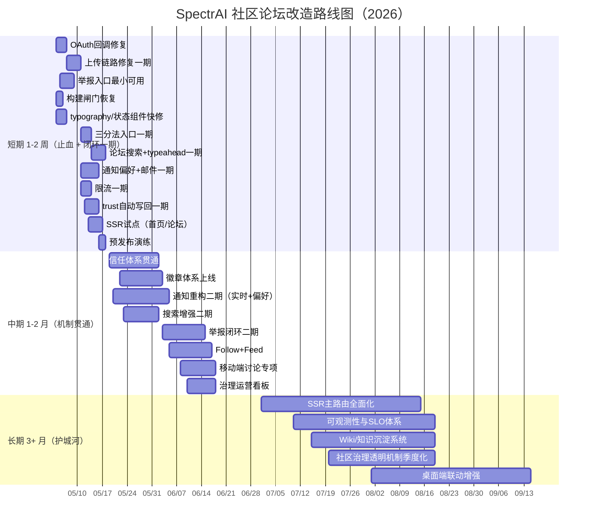

# SpectrAI 社区论坛改造路线图（Roadmap）

> 文档编号：03
> 
> 上游输入：[00-current-state-analysis.md](./00-current-state-analysis.md) · [02-gap-analysis.md](./02-gap-analysis.md)
> 
> 下游执行：[04-p0-detailed-plan.md](./04-p0-detailed-plan.md) · [05-next-steps.md](./05-next-steps.md)

---

## 1. 指导原则（三条）

### 原则一：先修“断点”，再做“扩展”

- 断点指会直接阻断用户关键路径的问题。
- 包括：登录断点、上传断点、举报断点、检索断点、治理断点。
- 任何新增功能如果不能先修断点，都应降级优先级。

### 原则二：先做“机制闭环”，再做“界面装饰”

- 社区不是页面集合，而是机制系统。
- 机制闭环包括：发现→参与→反馈→治理→成长→回访。
- 本路线图优先级按机制闭环排序，不按页面数量排序。

### 原则三：每阶段都必须可验收、可回滚

- 每个阶段必须定义交付物。
- 每个交付物必须定义验收门槛。
- 每个关键变更必须有回滚策略。

---

## 2. 路线图范围与假设

### 2.1 范围

- 范围包含：论坛信息架构、搜索、通知、治理、信任体系、性能底盘。
- 范围不包含：重做品牌视觉、重构全部业务域、一次性平台迁移。

### 2.2 假设

- 已有前后端骨架可持续迭代（`docs/community-revamp/raw/raw_backend.md:133-350`）。
- 当前主要瓶颈在机制闭环和工程质量，不在“有没有接口”。
- 目标是从“可用社区”进化到“可持续社区”。

### 2.3 基线问题清单（摘要）

- OAuth 回调损坏（`docs/community-revamp/raw/raw_frontend.md:950`）。
- 上传链路错误（`docs/community-revamp/raw/raw_frontend.md:954-963`）。
- 全局搜索缺失（`docs/community-revamp/raw/raw_frontend.md:529-531`）。
- 举报闭环缺失（`docs/community-revamp/raw/raw_backend.md:607-608`）。
- 限流缺失（`docs/community-revamp/raw/raw_backend.md:643`）。
- CSR 过重（`docs/community-revamp/raw/raw_frontend.md:219`）。

---

## 3. 短期路线（1–2 周）

> 目标：把 P0 断点修到“可上线内测”的最低门槛。

## 3.1 Week 1（止血周）

### Week 1 交付主题

- 修复关键断点。
- 恢复工程闸门。
- 补齐最小治理安全网。

### Week 1 任务拆解总表

| 编号 | 任务 | 交付物 | 验收标准 | 顺序依赖 |
|---|---|---|---|---|
| W1-01 | OAuth 回调修复 | 可用 callback 页面 + 成功登录跳转 | 能完成完整登录，不再显示 TODO 错误 | 无 |
| W1-02 | 上传链路修复一期 | 前端真实上传接入 + 后端 confirm 校验增强 | 发帖图片可跨会话可见，坏链率显著下降 | W1-01 并行 |
| W1-03 | 举报按钮最小可用 | 前端举报入口 + 后端临时接收接口 | 举报动作有反馈且可入库 | W1-02 并行 |
| W1-04 | 全局搜索入口上线一期 | Header 增加搜索入口（先跳转搜索页） | 任意页面可一跳进入搜索路径 | 无 |
| W1-05 | 构建质量闸门恢复 | next.config 关闭 ignoreBuildErrors/ignoreDuringBuilds | PR 中 TS/ESLint 错误可阻断 | 无 |
| W1-06 | typography 插件启用 | prose 样式恢复 | Markdown 与协议页可读性明显提升 | 无 |
| W1-07 | 死链修复 `/user/me` | 菜单跳转正确 | 登录后“我的主页”可访问 | 无 |
| W1-08 | 统一状态组件骨架 | `LoadingState/ErrorState/EmptyState` 三件套 | 3 个核心页面完成替换 | 无 |
| W1-09 | 通知轮询降噪 | 页面可见性感知 + 退避策略 | 后台无效轮询显著下降 | 无 |
| W1-10 | 上传安全补丁 | MIME 白名单 + 大小限制 | 非法文件被拦截，错误提示清晰 | W1-02 |
| W1-11 | like/favorite 事务修补 | 点赞收藏事务化 | 并发下计数一致性通过验证 | 无 |
| W1-12 | 文档化回归脚本 | 回归检查清单 v1 | 每次发布前可执行 | 依赖 W1-01~W1-11 |

### Week 1 验收门槛

- 登录成功率 ≥ 98%。
- 上传成功率 ≥ 97%。
- 关键死按钮清零（书签/举报/OAuth）。
- CI 重新具备质量阻断能力。

### Week 1 风险与对策

- 风险：一次恢复闸门会暴露大量历史告警。
- 对策：设置“先阻断 error，再逐步清理 warning”的过渡策略。

- 风险：上传修复牵涉前后端联调，可能拖延。
- 对策：分两步，先修正确性，再优化体验。

### Week 1 里程碑

- M1：登录可用。
- M2：上传可用。
- M3：基础治理入口可用。
- M4：质量闸门恢复。

## 3.2 Week 2（闭环周）

### Week 2 交付主题

- 把“能用”升级为“有闭环”。
- 打通搜索、通知、治理的最小闭环。

### Week 2 任务拆解总表

| 编号 | 任务 | 交付物 | 验收标准 | 顺序依赖 |
|---|---|---|---|---|
| W2-01 | 论坛三分法入口上线 | 分类/最新/热门并列入口 | 首屏路径可直接触达三视角 | 依赖 W1-04 |
| W2-02 | 论坛搜索 API 一期 | 帖子标题+标签基础检索 | 查询延时满足可用门槛 | 依赖 W2-01 |
| W2-03 | typeahead 一期 | 输入即候选（标题/标签） | 搜索候选点击率可采集 | 依赖 W2-02 |
| W2-04 | 通知偏好模型一期 | 偏好表与偏好 API | 用户可开关核心通知类型 | 依赖 W1-09 |
| W2-05 | 邮件通知一期 | 异步队列 + 模板 + 退订基础 | 评论/回复类邮件可控送达 | 依赖 W2-04 |
| W2-06 | 举报闭环一期 | 举报入库→审核队列→处理反馈 | 举报可追踪，处理有状态 | 依赖 W1-03 |
| W2-07 | 限流一期 | IP+用户双维度策略 | 高频刷请求被限制 | 无 |
| W2-08 | trust level 自动写回一期 | 升级规则 + 定时任务 | 指标触发后可自动升级 | 无 |
| W2-09 | 帖子详情交互修补 | 引用、@、书签行为闭环 | 详情页关键互动全部可用 | 依赖 W1-03 |
| W2-10 | SSR 试点页面 | 首页/论坛列表 SSR/ISR 试点 | 首屏可见内容显著改善 | 无 |
| W2-11 | 指标埋点一期 | 搜索、通知、举报、登录埋点 | 能出首版运营看板 | 依赖 W2-01~W2-09 |
| W2-12 | 预发布演练 | 灰度流程 + 回滚流程演练 | 回滚演练成功 | 依赖 W2-01~W2-11 |

### Week 2 验收门槛

- 三分法入口可用。
- 搜索入口与候选可用。
- 举报流程可追踪。
- 通知偏好可配置。
- 限流规则在线可验证。

### Week 2 风险与对策

- 风险：typeahead 精度不足导致用户不信任搜索。
- 对策：先保障召回，再做排序优化。

- 风险：邮件通知可能引发误触达投诉。
- 对策：默认低频策略 + 明确退订入口。

### Week 2 里程碑

- M5：搜索闭环一期。
- M6：通知闭环一期。
- M7：治理闭环一期。
- M8：性能试点一期。

---

## 4. 中期路线（1–2 月）

> 目标：从“可内测”升级到“可持续运营”。

## 4.1 第 1 个月（机制贯通）

### 月度主题

- 完整打通信任体系、徽章体系、通知重构。
- 将 P1 能力中的关键增长项落地。

### 任务包 M1-A：信任体系贯通

- 定义 TL0-TL4 升级与降级规则。
- 绑定发帖、回复、被赞、举报、违规行为。
- 在用户页展示当前等级与升级条件。
- 接入审核权重与日限额。

#### 交付物

- trust 规则配置中心。
- 自动升级任务。
- 等级展示组件。
- 运维可调参数面板。

#### 验收标准

- 升级规则可解释。
- 升级链路可审计。
- 违规降级可回放。

### 任务包 M1-B：徽章体系上线

- 将 `user_badges` 从预留转为业务表。
- 设计成长、贡献、协作、纪念 4 类徽章。
- 为徽章定义授予条件与撤销条件。
- 在个人主页与帖子身份区展示。

#### 交付物

- 徽章规则配置。
- 徽章授予任务。
- 徽章页面与授予说明页。

#### 验收标准

- 徽章授予规则可复核。
- 用户能查看“为什么拿到徽章”。

### 任务包 M1-C：通知体系重构二期

- 站内通知结构规范化。
- 邮件通知模板化、分层发送。
- 实时推送通道（WebSocket）上线。
- 通知偏好支持类型 × 渠道配置。

#### 交付物

- 通知事件总线。
- 通知偏好中心。
- 邮件触达面板。
- 实时推送服务与降级策略。

#### 验收标准

- 通知送达率可观测。
- 实时通道可回退到轮询。
- 用户可静默某类通知。

### 任务包 M1-D：搜索增强二期

- 论坛搜索增加排序与过滤。
- typeahead 加入热门词与最近访问。
- 补齐中文分词基础优化。

#### 验收标准

- 搜索点击率提升。
- 重复帖比例下降。

## 4.2 第 2 个月（增长与治理）

### 月度主题

- 强化社区共治效率。
- 建立增长回路（Follow/Feed）。

### 任务包 M2-A：举报闭环二期

- 举报阈值自动隐藏。
- 审核队列优先级策略。
- 申诉流程与处理 SLA。
- 举报处理透明反馈。

#### 验收标准

- 举报处理可追踪率 100%。
- 误判回滚流程可执行。

### 任务包 M2-B：Follow + Feed

- 关注/取关接口与关系表上线。
- Feed 聚合关注对象动态。
- Feed 支持分页与去重。

#### 验收标准

- 关注行为可逆。
- Feed 时序稳定。

### 任务包 M2-C：移动端讨论能力增强

- 输入法遮挡治理。
- 回复/引用/代码块移动端交互优化。
- 移动端通知与阅读回跳增强。

#### 验收标准

- 移动端发帖/回帖完成率提升。

### 任务包 M2-D：运营治理看板

- 内容质量看板。
- 举报处理看板。
- 搜索复用看板。
- 通知触达看板。

#### 验收标准

- 每周可产出治理与增长复盘报告。

---

## 5. 长期路线（3+ 月）

> 目标：建设“高质量中文技术社区”的长期护城河。

## 5.1 社区治理长期化

- 完整版共治策略库。
- 版主工具链升级。
- 治理透明季度报告制度化。
- 规则实验（A/B）机制。

## 5.2 SSR 与性能体系化

- 从试点页面扩展到核心路由。
- 完整的 ISR/缓存策略分层。
- 图片与静态资源优化标准化。
- 长帖子分页/虚拟化策略。

## 5.3 可观测性与 SLO

- 建立社区核心 SLI/SLO：
  - 登录成功率
  - 发帖成功率
  - 搜索响应
  - 通知送达
  - 举报处理时效
- 统一告警、追踪、错误预算机制。

## 5.4 内容沉淀系统

- Wiki 帖能力。
- 知识专题页。
- 高价值帖子结构化抽取。
- 搜索与推荐联动。

## 5.5 产品协同长期项

- Web 与桌面端社区联动增强。
- Deep Link 流程治理与观测。
- 社区身份与桌面身份一致性强化。

---

## 6. 富上下文 Mermaid Gantt 图

---

## 7. 资源/人手估计区间（仅工作量）

> 单位：人·日（PD）

## 7.1 短期（1–2 周）

| 工作流 | 估计区间（PD） | 说明 |
|---|---:|---|
| 登录与认证修复 | 3–5 | 含回调、异常处理、联调 |
| 上传链路修复 | 4–7 | 含前后端与存储验证 |
| 举报最小链路 | 4–6 | 含前端入口、后端入库 |
| 搜索入口与一期 | 4–6 | 含 Header 与 API 一期 |
| 通知偏好/邮件一期 | 5–8 | 含模板与队列初版 |
| 限流一期 | 3–5 | 含策略、灰度、回滚 |
| SSR 试点 | 5–8 | 首页+论坛列表 |
| 质量闸门恢复与告警清理 | 3–6 | 含基础债务清理 |
| 合计（短期） | **31–51** | 可并行压缩日历时间 |

## 7.2 中期（1–2 月）

| 工作流 | 估计区间（PD） | 说明 |
|---|---:|---|
| 信任体系贯通 | 8–14 | 规则 + 任务 + 展示 |
| 徽章体系上线 | 6–10 | 规则、授予、展示 |
| 通知重构二期 | 10–16 | 实时推送 + 偏好深化 |
| 举报闭环二期 | 8–12 | 自动隐藏、复核、申诉 |
| Follow + Feed | 8–14 | 关系与聚合流 |
| 搜索增强二期 | 6–10 | 排序、过滤、分词优化 |
| 移动端讨论专项 | 6–10 | 输入/引用/回跳细节 |
| 运营治理看板 | 5–8 | 指标模型与面板 |
| 合计（中期） | **57–94** | 需分批迭代上线 |

## 7.3 长期（3+ 月）

| 工作流 | 估计区间（PD） | 说明 |
|---|---:|---|
| SSR 全面化 | 20–35 | 主路由重构 |
| 可观测性体系 | 15–28 | 指标/追踪/告警 |
| Wiki 与知识沉淀 | 12–24 | 协作编辑与历史 |
| 治理透明机制 | 8–14 | 报表与流程化 |
| 桌面端联动增强 | 15–30 | 跨端协议与同步 |
| 合计（长期） | **70–131** | 建议季度化拆分 |

---

## 8. 阶段结束标志与验收门槛

## 8.1 短期结束标志（Gate-S）

### 必达项

- OAuth 回调可用。
- 上传链路可用且安全校验到位。
- 举报入口不再是死按钮。
- 三分法入口与搜索入口可用。
- 限流一期上线。
- CI 质量闸门恢复。

### 验收门槛

- 登录成功率 ≥ 98%。
- 上传成功率 ≥ 97%。
- 关键交互死链数 = 0。
- 搜索入口点击可达率 = 100%。
- 构建阻断策略生效。

## 8.2 中期结束标志（Gate-M）

### 必达项

- 信任等级自动写回可运行。
- 徽章体系可见且可解释。
- 通知偏好+邮件+实时三通道打通。
- 举报闭环含自动隐藏与复核。
- Follow + Feed 可用。

### 验收门槛

- 举报处理可追踪率 = 100%。
- 通知送达率 ≥ 95%。
- 误触达投诉率受控。
- 论坛重复帖占比下降趋势明确。

## 8.3 长期阶段门槛（Gate-L）

### 必达项

- 核心内容路由 SSR 化完成。
- 可观测性与 SLO 体系稳定运行。
- Wiki 与知识沉淀路径可持续运营。
- 治理透明机制季度化发布。

### 验收门槛

- 关键页面首屏指标持续达标。
- 线上重大回归事件显著下降。
- 高质量内容复用率提升。

---

## 9. 依赖关系与关键路径

## 9.1 关键路径

1. 登录修复 → 上传修复 → 举报入口可用。
2. 三分法入口 → 搜索一期 → typeahead。
3. 通知偏好模型 → 邮件一期 → 实时推送。
4. trust 自动写回 → 徽章展示 → 身份体系闭环。

## 9.2 高风险依赖

- 上传链路依赖对象存储配置稳定。
- 通知邮件依赖队列与模板质量。
- SSR 改造依赖页面数据获取重构。

## 9.3 解耦建议

- 将 P0 任务按“可独立发布”切分。
- 把规则引擎与 UI 展示分开发布。
- 把搜索召回与排序优化分阶段。

---

## 10. 指标体系（分阶段）

## 10.1 北极星指标（社区阶段）

- 周活跃讨论用户数（WAU-discussion）。
- 高质量帖子占比。
- 搜索复用率（搜索后点击旧帖并未新发帖）。

## 10.2 短期指标

- 登录成功率。
- 上传成功率。
- 报错率。
- 死按钮回归数。

## 10.3 中期指标

- 举报处理时效。
- 通知触达率。
- 信任等级晋升分布。
- 徽章获得分布。

## 10.4 长期指标

- 内容复用率。
- 知识沉淀增长率。
- 治理争议处理满意度。
- 社区留存率。

---

## 11. 发布策略建议

## 11.1 发布节奏

- 每周小版本（修复与快赢）。
- 双周中版本（闭环增强）。
- 月度大版本（机制升级）。

## 11.2 灰度策略

- 新能力先灰度给活跃用户样本。
- 治理规则先低强度启动，再调参。
- 搜索排序先双轨对比再切流。

## 11.3 回滚策略

- 登录/上传/举报等关键链路都要有 feature flag。
- 通知多通道要支持逐通道降级。
- SSR 改造按路由级可回退。

---

## 12. 与其他文档的衔接

- 本文解决“按时间做什么”。
- [04-p0-detailed-plan.md](./04-p0-detailed-plan.md) 解决“每个 P0 怎么做”。
- [05-next-steps.md](./05-next-steps.md) 解决“今天就能开工什么”。

---

## 附录 A：短期任务清单（可直接导入项目管理工具）

- [ ] W1-01 OAuth 回调修复
- [ ] W1-02 上传链路修复一期
- [ ] W1-03 举报入口最小可用
- [ ] W1-04 全局搜索入口一期
- [ ] W1-05 构建闸门恢复
- [ ] W1-06 typography 快修
- [ ] W1-07 `/user/me` 修复
- [ ] W1-08 状态组件三件套
- [ ] W1-09 通知轮询降噪
- [ ] W1-10 上传安全补丁
- [ ] W1-11 like/favorite 事务修补
- [ ] W1-12 回归脚本 v1
- [ ] W2-01 三分法入口上线
- [ ] W2-02 搜索 API 一期
- [ ] W2-03 typeahead 一期
- [ ] W2-04 通知偏好一期
- [ ] W2-05 邮件通知一期
- [ ] W2-06 举报闭环一期
- [ ] W2-07 限流一期
- [ ] W2-08 trust 自动写回一期
- [ ] W2-09 帖详交互修补
- [ ] W2-10 SSR 试点
- [ ] W2-11 指标埋点一期
- [ ] W2-12 预发布演练

## 附录 B：中期任务清单

- [ ] M1-A 信任体系贯通
- [ ] M1-B 徽章体系上线
- [ ] M1-C 通知重构二期
- [ ] M1-D 搜索增强二期
- [ ] M2-A 举报闭环二期
- [ ] M2-B Follow + Feed
- [ ] M2-C 移动端讨论专项
- [ ] M2-D 运营治理看板

## 附录 C：长期任务清单

- [ ] L1 SSR 主路由全面化
- [ ] L2 可观测性与 SLO 体系
- [ ] L3 Wiki 与知识沉淀
- [ ] L4 治理透明机制季度化
- [ ] L5 桌面端联动增强

## 附录 D：阶段验收检查表

- [ ] Gate-S 所有必达项完成
- [ ] Gate-M 所有必达项完成
- [ ] Gate-L 所有必达项完成
- [ ] 回滚演练记录完整
- [ ] 关键指标可被持续采集

文档结束。
