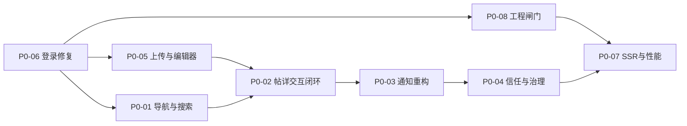
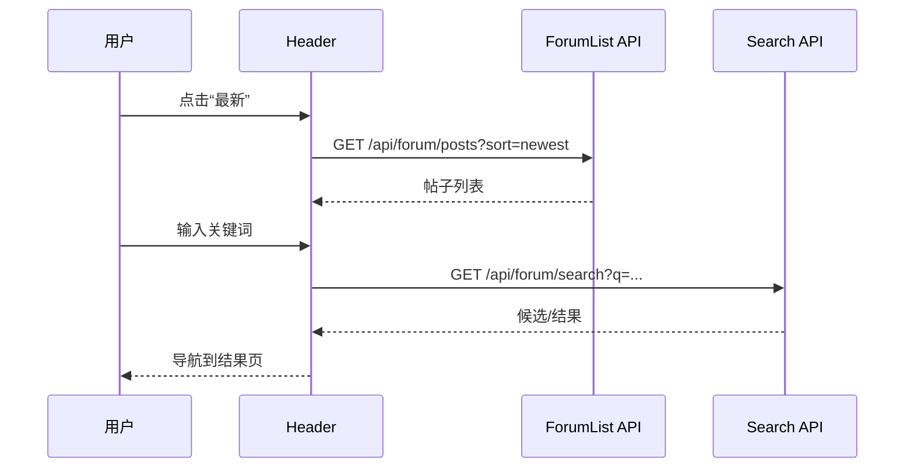
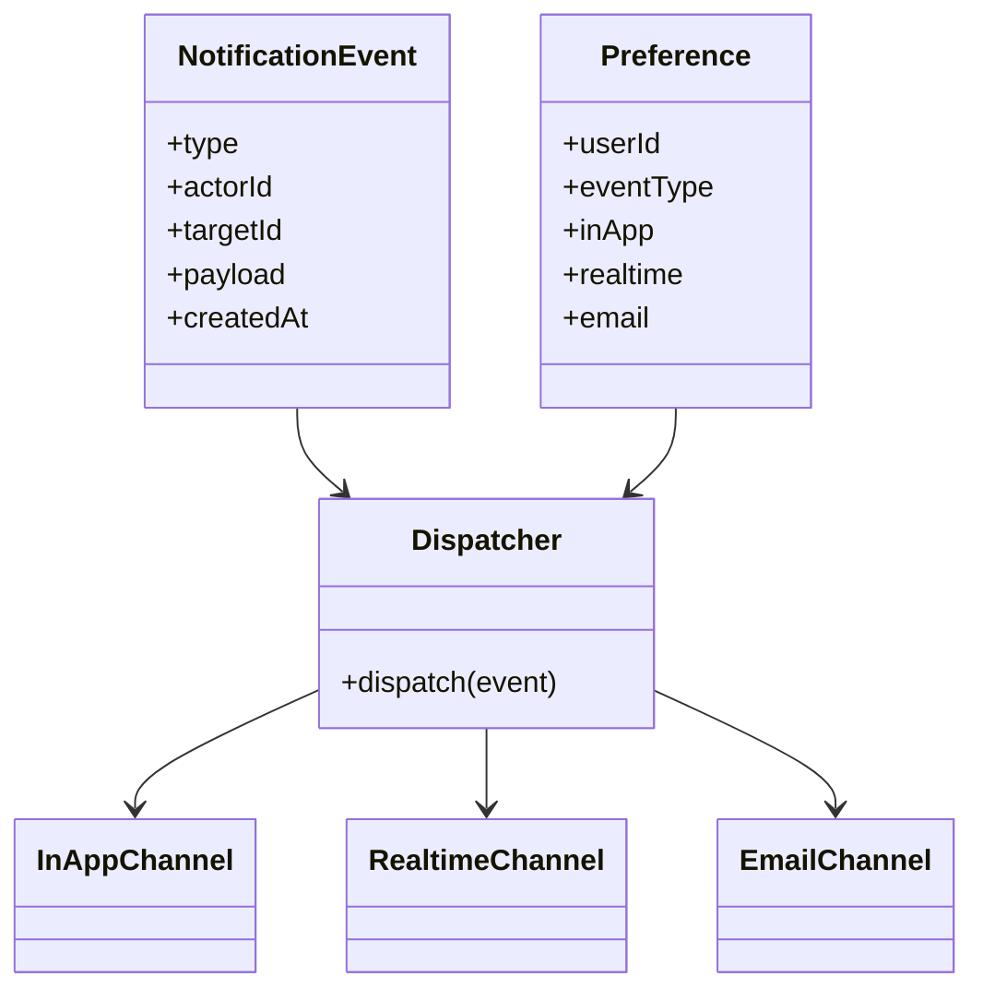
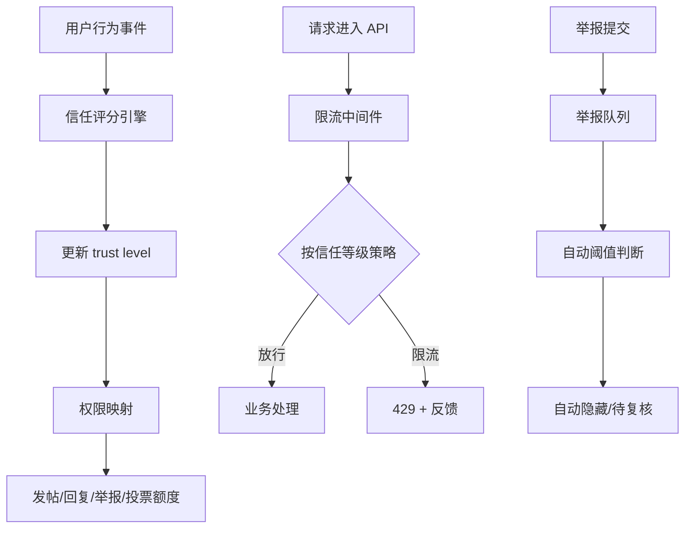
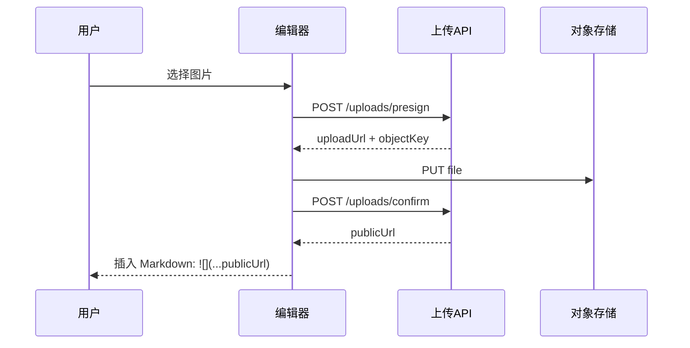
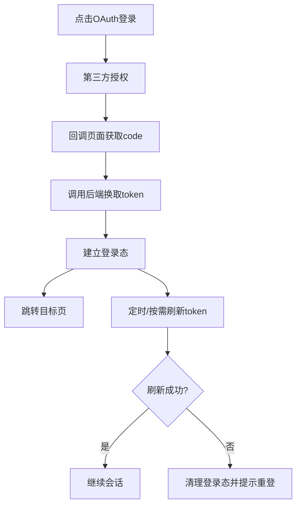
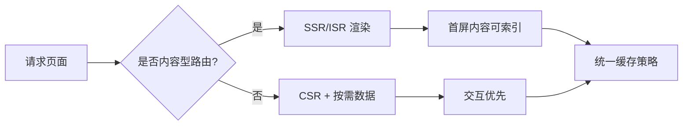
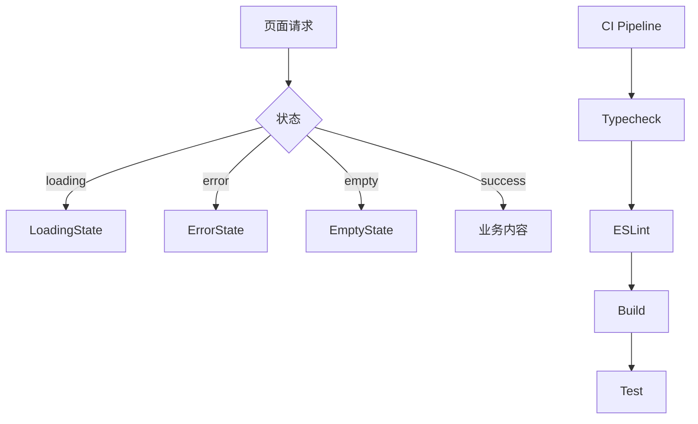

# SpectrAI 社区论坛改造：P0 详细改造方案

> 文档编号：04
> 
> 上游：[`02-gap-analysis.md`](./02-gap-analysis.md)
> 
> 目标：将 P0 前 8 项转为可直接执行的工程包。

---

## 0. 方案总览

### 0.1 P0 项目列表（本轮）

1. P0-01：首页信息流重构 + 顶导三分法 + 全局搜索入口
2. P0-02：帖子详情页重设（引用/@/书签/举报/阅读路径）
3. P0-03：通知体系重构（站内 + 偏好 + 邮件 + 实时）
4. P0-04：信任等级贯通 + 反垃圾 + 限流
5. P0-05：上传与 Markdown 体系修复（含安全）
6. P0-06：OAuth 主登录修复 + token 生命周期治理
7. P0-07：SSR 主路由化 + 性能主路径治理
8. P0-08：统一状态组件沉淀 + 工程质量闸门恢复

### 0.2 执行顺序（建议）

- 第一波（断点止血）：P0-06、P0-05、P0-08。
- 第二波（可用闭环）：P0-01、P0-02、P0-03。
- 第三波（治理底盘）：P0-04、P0-07。

### 0.3 依赖关系图



---

## 1. P0-01 首页信息流重构 + 顶导三分法 + 全局搜索入口

### 1.1 问题陈述

- 当前 Header 无全局搜索入口，论坛无全局检索入口（`docs/community-revamp/raw/raw_frontend.md:529-531`）。
- 首页信息区“有内容块但缺路径策略”，用户不知道先看什么。
- Linux.do 的分类/最新/热门三分法是首屏核心效率来源（`docs/community-revamp/01-linuxdo-benchmark.md:192-218`）。

### 1.2 根因分析

1. 前端导航主要按“站点栏目”组织，不按“用户意图”组织。
2. 后端已有论坛列表能力，但前端没有把排序视角产品化。
3. 搜索在 marketplace 局部可用，但未抽象为全站能力。

证据：

- `docs/community-revamp/raw/raw_frontend.md:521-531`
- `docs/community-revamp/raw/raw_backend.md:225-247`
- `docs/community-revamp/01-linuxdo-benchmark.md:374-400`

### 1.3 改造思路

- 把导航主路径改为：分类 / 最新 / 热门 / 搜索。
- 搜索一期先实现“入口统一 + 搜索页统一 + 基础候选”。
- 三分法与搜索共享同一查询模型，减少状态分裂。



### 1.4 设计草图（文字 Wireframe）

- 顶部第一行：Logo + 主导航（分类/最新/热门）+ 全局搜索框 + 用户菜单。
- 搜索框支持：
  - 输入时展示 5 条候选。
  - `Enter` 跳结果页。
  - 候选包括帖子标题和标签。
- 首页正文：
  - 第一屏上半是“最新/热门 切换 Tab + 列表”。
  - 第一屏下半是“分类卡片（描述+活跃度）”。
- 移动端：
  - 顶部只保留 logo 与搜索按钮。
  - 三分法放在二级 sticky tab。

### 1.5 影响文件/模块清单

- 前端：
  - `apps/web/src/components/layout/Header.tsx`
  - `apps/web/src/app/page.tsx`
  - `apps/web/src/app/forum/page.tsx`
  - `apps/web/src/components/SearchBar.tsx`（升级为全局）
- 后端：
  - `apps/api/src/routes/forum.ts`（新增搜索/排序扩展）
  - `apps/api/src/routes/index.ts`（必要时挂载）
- 共享：
  - `packages/shared/src/types/*` 搜索结果类型

### 1.6 数据迁移需求

- 无硬性数据迁移。
- 若新增“搜索热词”可建轻量表（可后置）。

### 1.7 预估工作量

- 6–10 人·日。

### 1.8 验收标准

- Header 任意页面可直达搜索。
- 分类/最新/热门入口稳定可用。
- 搜索结果可返回帖子与标签候选。
- 首屏路径点击率可采集。

### 1.9 风险与依赖

- 风险：搜索精度不足影响信任。
- 依赖：论坛搜索 API 一期可用。
- 缓解：先保证召回，再做排序优化。

### 1.10 子任务分解

- [ ] 设计导航信息架构草案
- [ ] 设计搜索交互状态机
- [ ] 改 Header 结构与移动端折叠
- [ ] 改首页为“信息流入口页”
- [ ] 增加论坛搜索 API 一期
- [ ] 增加搜索结果页
- [ ] 埋点：入口点击、搜索触发、结果点击
- [ ] 回归：键盘导航与移动端可用性

---

## 2. P0-02 帖子详情页重设（引用/@/书签/举报/阅读路径）

### 2.1 问题陈述

- 书签与举报按钮无 onClick（`docs/community-revamp/raw/raw_frontend.md:1004-1021`）。
- 回复框体验弱，和发帖编辑器割裂（`docs/community-revamp/raw/raw_frontend.md:412`）。
- 缺阅读进度与深阅读导航机制。

### 2.2 根因分析

1. 前端帖子详情页把“显示”优先于“互动闭环”。
2. 后端论坛接口完整，但缺举报/@提醒/最佳答案等治理端点。
3. 交互组件未按“长帖讨论”场景设计。

证据：

- `docs/community-revamp/raw/raw_frontend.md:238`
- `docs/community-revamp/raw/raw_frontend.md:1004-1021`
- `docs/community-revamp/raw/raw_backend.md:245`

### 2.3 改造思路

- 先修死按钮，再补齐互动闭环。
- 回复编辑器统一到 MarkdownEditor 体系。
- 引入“引用回复”与“@提及候选”最小可用版。
- 增加“阅读进度+楼层锚点”轻量能力。

```mermaid
flowchart TD
  A[进入帖子详情] --> B[渲染正文+楼层]
  B --> C[点击引用]
  C --> D[在回复框插入引用块]
  D --> E[输入@]
  E --> F[弹出用户候选]
  F --> G[提交回复]
  G --> H[通知被提及者]
  B --> I[点击举报]
  I --> J[打开举报弹窗]
  J --> K[提交至审核队列]
```

### 2.4 设计草图（文字 Wireframe）

- 帖子顶部区：标题、标签、作者、发布时间、操作区（收藏/举报/分享）。
- 主体区：正文 + 楼层列表。
- 右侧（桌面）：阅读进度条 + 楼层锚点导航。
- 底部固定回复区：
  - 支持 Markdown。
  - 支持引用块预览。
  - 支持 @ 候选下拉。
- 举报弹窗：
  - 举报类型
  - 说明输入
  - 提交后显示工单编号

### 2.5 影响文件/模块清单

- 前端：
  - `apps/web/src/app/forum/post/[id]/page.tsx`
  - `apps/web/src/components/reply-tree.tsx`
  - `apps/web/src/components/markdown-editor.tsx`
  - 新增 `apps/web/src/components/forum/report-modal.tsx`
- 后端：
  - `apps/api/src/routes/forum.ts`（@解析可先后置）
  - 新增 `apps/api/src/routes/reports.ts` 或并入 forum admin
  - `apps/api/src/routes/notifications.ts`
- 数据层：
  - 新增举报表（详见 P0-04）

### 2.6 数据迁移需求

- 新增 `forum_reports`（建议名）并创建索引。
- 现有帖子数据无需迁移。

### 2.7 预估工作量

- 8–14 人·日。

### 2.8 验收标准

- 书签与举报按钮均有完整可见反馈。
- 回复框支持引用插入与 @ 基础候选。
- 举报单可在后台查询并处理。
- 长帖阅读有可感知的进度导航。

### 2.9 风险与依赖

- 风险：@ 提及误召回导致通知噪声。
- 依赖：通知体系一期（P0-03）支持新类型。
- 缓解：@提醒加频控与去重。

### 2.10 子任务分解

- [ ] 修复书签按钮行为与视觉状态
- [ ] 新增举报弹窗与提交流程
- [ ] 回复编辑器统一
- [ ] 增加引用块插入逻辑
- [ ] 增加 @ 候选组件
- [ ] 增加楼层锚点导航
- [ ] 对接通知与审核链路
- [ ] 加入端到端回归测试

---

## 3. P0-03 通知体系重构（站内 + 偏好 + 邮件 + 实时）

### 3.1 问题陈述

- 当前仅有站内通知列表 CRUD，缺偏好/邮件/实时（`docs/community-revamp/raw/raw_backend.md:309`）。
- 前端通知轮询策略粗糙（`docs/community-revamp/raw/raw_frontend.md:431`）。
- 社区召回能力不足，讨论链路易中断。

### 3.2 根因分析

1. 通知只作为“消息列表”实现，未当作“事件系统”设计。
2. 缺通知事件模型（谁触发、触发什么、如何投递）。
3. 缺用户偏好导致“要么打扰过多，要么打扰不足”。

证据：

- `docs/community-revamp/raw/raw_backend.md:300-311`
- `docs/community-revamp/raw/raw_backend.md:715-716`
- `docs/spectrai-community-brainstorm.md:476-499`

### 3.3 改造思路

- 建立通知事件总线：`domain event -> channel routing`。
- 通知分三通道：站内、实时、邮件。
- 偏好中心支持“通知类型 × 渠道”配置。
- 支持静默策略与退订策略。



### 3.4 设计草图（文字 Wireframe）

- 顶部铃铛：
  - 未读角标
  - 最近通知列表
  - 一键标记已读
  - 跳转通知中心
- 通知中心页：
  - 分类筛选（回复、@、系统、治理）
  - 状态筛选（未读/已读）
  - 批量操作
- 偏好页：
  - 每种通知类型对应三列开关（站内/实时/邮件）
  - 全局静默时段

### 3.5 影响文件/模块清单

- 前端：
  - `apps/web/src/components/notification-bell.tsx`
  - `apps/web/src/app/notifications/page.tsx`
  - 新增 `apps/web/src/app/settings/notifications/page.tsx`
- 后端：
  - `apps/api/src/routes/notifications.ts`
  - 新增 `apps/api/src/services/notification-dispatcher.ts`
  - 新增 `apps/api/src/services/notification-preference.ts`
- 基础设施：
  - 邮件队列服务
  - WebSocket/SSE 实时通道

### 3.6 数据迁移需求

- 新增 `notification_preferences` 表。
- `notifications` 表补必要字段（如 channel/sourceType，可选）。
- 历史通知可不迁移偏好，采用默认策略。

### 3.7 预估工作量

- 10–16 人·日。

### 3.8 验收标准

- 用户可配置通知偏好。
- 站内通知、实时通知、邮件通知均可触达。
- 通知触达失败有重试或降级策略。
- 通知中心可追溯通知来源。

### 3.9 风险与依赖

- 风险：邮件触达策略不当导致投诉。
- 依赖：事件触发点（论坛、资源、治理）统一化。
- 缓解：先低频默认，再逐步开放细粒度配置。

### 3.10 子任务分解

- [ ] 设计通知事件模型
- [ ] 设计偏好表与 API
- [ ] 改造铃铛组件
- [ ] 增加通知中心筛选能力
- [ ] 邮件通道一期
- [ ] 实时通道一期
- [ ] 失败重试与降级策略
- [ ] 监控埋点与告警

---

## 4. P0-04 信任等级贯通 + 反垃圾 + 限流

### 4.1 问题陈述

- `trust_levels` 目前读多写少，自动升级写回缺（`docs/community-revamp/raw/raw_backend.md:273`）。
- 举报机制未闭环（`docs/community-revamp/raw/raw_backend.md:607-608`）。
- 全平台限流缺失（`docs/community-revamp/raw/raw_backend.md:643`）。

### 4.2 根因分析

1. 数据结构先行，但规则引擎未落地。
2. 治理动作没有被产品化成标准流程。
3. 风控与社区机制脱节（技术限流 vs 社区信任分层）。

证据：

- `docs/community-revamp/raw/raw_backend.md:389`
- `docs/community-revamp/raw/raw_backend.md:457`
- `docs/community-revamp/01-linuxdo-benchmark.md:706-758`

### 4.3 改造思路

- 建立“信任评分 + 权限映射 + 风险策略”统一框架。
- 举报系统与信任等级联动：高信任举报更快进入处理。
- 限流策略按用户状态分层：游客/新手/普通/高信任。



### 4.4 设计草图（文字 Wireframe）

- 用户页面新增“信任等级卡片”：
  - 当前等级
  - 距离下一等级所需行为
  - 权限说明
- 版主后台新增“治理队列”：
  - 举报单列表
  - 优先级标记
  - 自动隐藏状态
  - 处理 SLA 计时
- 用户侧举报反馈：
  - 举报已受理
  - 处理中
  - 处理结果

### 4.5 影响文件/模块清单

- 后端：
  - `apps/api/src/routes/forum.ts`
  - 新增 `apps/api/src/routes/reports.ts`
  - 新增 `apps/api/src/middleware/rate-limit.ts`
  - `apps/api/src/services/trust-level-service.ts`
- 前端：
  - 举报入口组件
  - 举报进度展示组件
  - 用户等级展示组件
- 数据层：
  - `trust_levels` 写回逻辑
  - 举报表、举报日志表

### 4.6 数据迁移需求

- 新增 `forum_reports`、`report_actions`（建议命名）。
- 为 `trust_levels` 增加更新时间与来源字段（可选）。
- 迁移脚本需保证幂等。

### 4.7 预估工作量

- 12–20 人·日。

### 4.8 验收标准

- trust 等级可自动更新并可解释。
- 举报从提交到处理可追踪。
- 限流策略在线生效且误伤可控。
- 审核队列可按优先级处理。

### 4.9 风险与依赖

- 风险：规则过严伤害真实新手。
- 风险：规则过松放大垃圾内容。
- 依赖：通知系统支撑治理反馈。
- 缓解：灰度调参 + 人工抽样复核。

### 4.10 子任务分解

- [ ] 设计信任评分规则
- [ ] 实现 trust 写回任务
- [ ] 实现限流中间件
- [ ] 实现举报模型与路由
- [ ] 实现审核队列
- [ ] 实现自动隐藏阈值
- [ ] 实现处理反馈通知
- [ ] 建立治理看板指标

---

## 5. P0-05 上传与 Markdown 体系修复（含安全）

### 5.1 问题陈述

- 前端图片上传目前生成 blob URL，提交后失效（`docs/community-revamp/raw/raw_frontend.md:954-963`）。
- Markdown 渲染器手写，存在维护与 XSS 风险（`docs/community-revamp/raw/raw_frontend.md:388`，`docs/community-revamp/raw/raw_frontend.md:725-727`）。
- typography 插件缺失，导致正文阅读体验差（`docs/community-revamp/raw/raw_frontend.md:44-46`）。

### 5.2 根因分析

1. 编辑器把“本地预览 URL”误当成“持久 URL”。
2. 内容渲染缺少标准库与 sanitization 体系。
3. 样式插件缺失导致长文排版崩坏。

### 5.3 改造思路

- 上传流程改为：选择文件 → 后端 presign → 直传对象存储 → confirm → 返回可持久 URL。
- 渲染层改为成熟方案（例如 react-markdown + GFM + sanitize 思路）。
- 统一 Markdown 样式规范，并恢复 typography。



### 5.4 设计草图（文字 Wireframe）

- 编辑器工具栏：
  - 图片按钮点击后弹出上传状态。
  - 显示：上传中、成功、失败重试。
- 预览面板：
  - 使用统一 Markdown 渲染管线。
  - 危险标签与脚本内容被过滤。
- 发布页：
  - 发布前校验正文中是否有失效图片 URL。

### 5.5 影响文件/模块清单

- 前端：
  - `apps/web/src/components/markdown-editor.tsx`
  - `apps/web/src/components/image-upload.tsx`
  - `apps/web/src/components/markdown-renderer.tsx`
  - `apps/web/tailwind.config.js`
- 后端：
  - `apps/api/src/routes/uploads.ts`
  - `apps/api/src/lib/storage.ts`
- 配置：
  - MinIO/OSS 相关 env 与权限策略

### 5.6 数据迁移需求

- 历史帖子中的 `blob:` URL 需离线扫描。
- 可选方案：
  - 标记无效图片并提示作者补传。
  - 尝试从原帖附件还原（若有存储）。
- 建议增加迁移审计日志。

### 5.7 预估工作量

- 8–14 人·日。

### 5.8 验收标准

- 新发帖图片可跨会话、跨用户可见。
- Markdown 渲染通过安全基线检查。
- typography 排版恢复。
- 发布前校验可发现无效图片引用。

### 5.9 风险与依赖

- 风险：对象存储策略配置错误导致公开 URL 不可访问。
- 风险：渲染器替换可能引发旧文样式差异。
- 依赖：上传 API、存储权限、前端编辑器联调。

### 5.10 子任务分解

- [ ] 恢复 typography 插件
- [ ] 重写图片上传流程
- [ ] 补上传失败重试机制
- [ ] 渲染器替换与 sanitize
- [ ] 发布前 URL 校验
- [ ] 历史 blob 数据扫描脚本
- [ ] 增加上传/渲染回归测试
- [ ] 完成安全评审

---

## 6. P0-06 OAuth 主登录修复 + token 生命周期治理

### 6.1 问题陈述

- OAuth 回调页面当前为 TODO，占位错误（`docs/community-revamp/raw/raw_frontend.md:950`）。
- 认证缺 refresh token 生命周期管理（`docs/community-revamp/raw/raw_backend.md:259`）。
- 当前 token 主要在 localStorage，风险边界弱（`docs/community-revamp/raw/raw_frontend.md:719`）。

### 6.2 根因分析

1. 登录路径是“UI 先行，后端联调后置”。
2. 认证状态缺统一上下文，页面各自读取 token。
3. token 生命周期治理与错误回退策略不完整。

### 6.3 改造思路

- 第一阶段：修复 OAuth 回调成功链路。
- 第二阶段：补 refresh 机制与过期处理。
- 第三阶段：逐步提升 token 安全策略（按现网风险分层推进）。



### 6.4 设计草图（文字 Wireframe）

- 回调页状态机：
  - `处理中`（loading）
  - `成功`（1 秒后跳转）
  - `失败`（可重试、返回登录页）
- 登录页：
  - 明确展示 OAuth 与邮箱登录路径。
  - 错误提示区分网络失败、授权失败、服务器失败。

### 6.5 影响文件/模块清单

- 前端：
  - `apps/web/src/app/auth/spectrai/callback/page.tsx`
  - `apps/web/src/app/login/page.tsx`
  - `apps/web/src/components/layout/Header.tsx`
  - 新增 auth context/hooks
- 后端：
  - `apps/api/src/routes/auth.ts`
  - token 刷新相关服务（新增）

### 6.6 数据迁移需求

- 无表迁移硬依赖（若引入 refresh 表则需迁移）。
- 若调整 token 策略需兼容旧会话过渡。

### 6.7 预估工作量

- 6–10 人·日。

### 6.8 验收标准

- OAuth 登录完整成功链路可回归。
- token 过期后体验可控（自动刷新或显式重登）。
- 登录态读取逻辑统一化（不再散落复制）。

### 6.9 风险与依赖

- 风险：第三方授权配置与回调域名不一致。
- 依赖：后端 auth 接口与环境变量配置。
- 缓解：上线前做 staging 全链路演练。

### 6.10 子任务分解

- [ ] 回调页状态机实现
- [ ] 后端 token 交换接口确认
- [ ] 登录失败提示分类
- [ ] auth context 建设
- [ ] refresh 策略一期
- [ ] 过期会话清理策略
- [ ] 回归脚本（成功/失败/过期）
- [ ] 安全评审（XSS 场景）

---

## 7. P0-07 SSR 主路由化 + 性能主路径治理

### 7.1 问题陈述

- 动态页面高度 CSR，影响 SEO 与首屏（`docs/community-revamp/raw/raw_frontend.md:219`，`docs/community-revamp/raw/raw_frontend.md:623-627`）。
- 多处原生 img 与重复 fetch 模式，造成体验与性能损耗。

### 7.2 根因分析

1. 数据获取全部放在客户端，未利用 App Router SSR/ISR。
2. 缺统一缓存与重用策略。
3. 缺性能预算与指标门槛。

### 7.3 改造思路

- 按路径分层：
  - 首页、论坛列表、帖子详情优先 SSR/ISR。
  - 强交互页保留客户端，但下沉数据加载逻辑。
- 图片统一策略化（next/image 或等价优化手段）。
- 建立性能基线（LCP、TTFB、CLS）。



### 7.4 设计草图（文字 Wireframe）

- 首页：首屏直接包含可读内容，不等待前端全量水合。
- 论坛列表页：首屏列表 SSR，筛选交互再客户端增强。
- 帖子详情页：正文与主回复树 SSR，交互按钮客户端增强。

### 7.5 影响文件/模块清单

- 前端：
  - `apps/web/src/app/page.tsx`
  - `apps/web/src/app/forum/page.tsx`
  - `apps/web/src/app/forum/post/[id]/page.tsx`
  - 图片相关组件（ResourceCard/帖子头像等）
- 后端：
  - 相关列表与详情 API 的缓存头/分页策略

### 7.6 数据迁移需求

- 无表迁移。
- 可能需要缓存键策略调整（Redis）。

### 7.7 预估工作量

- 10–18 人·日。

### 7.8 验收标准

- 首页与论坛列表首屏内容无需等待客户端二次拉取。
- 内容型页面可被搜索引擎获取主体内容。
- 关键性能指标有可观测提升趋势。

### 7.9 风险与依赖

- 风险：SSR 改造引入数据一致性问题。
- 风险：缓存失效策略不当导致“看到旧数据”。
- 依赖：API 响应稳定、缓存策略改造。

### 7.10 子任务分解

- [ ] 选定 SSR 试点路由
- [ ] 改造数据获取边界
- [ ] 加入缓存策略
- [ ] 替换关键图片渲染路径
- [ ] 建立性能监测面板
- [ ] 设定性能回归阈值
- [ ] 回归 SEO 可抓取性
- [ ] 灰度发布与回滚预案

---

## 8. P0-08 统一状态组件沉淀 + 工程质量闸门恢复

### 8.1 问题陈述

- 加载/错误/空状态分散、样式不统一（`docs/community-revamp/raw/raw_frontend.md:562`，`docs/community-revamp/raw/raw_frontend.md:573`，`docs/community-revamp/raw/raw_frontend.md:579`）。
- 构建闸门关闭（`docs/community-revamp/raw/raw_frontend.md:123`，`docs/community-revamp/raw/raw_frontend.md:126`）。
- 重复逻辑（timeAgo/getAuthHeaders）增加维护噪音。

### 8.2 根因分析

1. MVP 速度优先，缺统一 UI 状态基建。
2. 为了出包速度关闭了构建阻断。
3. 公共能力未沉淀到 shared/lib 层。

### 8.3 改造思路

- 建立页面状态组件三件套：LoadingState/ErrorState/EmptyState。
- 恢复 TS/ESLint 阻断，并分阶段清理历史债。
- 抽取公共函数并建立 lint 规则防止再散落复制。



### 8.4 设计草图（文字 Wireframe）

- LoadingState：
  - 标准骨架布局
  - 可配置变体（列表、详情）
- ErrorState：
  - 错误标题
  - 人类可读说明
  - 重试按钮
  - 可选错误码
- EmptyState：
  - 插图占位
  - 描述
  - 主行动按钮

### 8.5 影响文件/模块清单

- 前端：
  - 新增 `apps/web/src/components/states/*`
  - 多页面替换状态分支
  - `apps/web/src/lib/utils.ts` 公共函数扩展
  - `apps/web/next.config.ts` 闸门恢复
- 工程：
  - CI 流程配置
  - lint 规则与代码规范文档

### 8.6 数据迁移需求

- 无数据迁移。

### 8.7 预估工作量

- 5–9 人·日。

### 8.8 验收标准

- 核心页面统一状态组件替换完成。
- 构建质量闸门恢复并生效。
- 重复函数收敛到公共模块。

### 8.9 风险与依赖

- 风险：恢复闸门后短期告警集中爆发。
- 依赖：团队接受“先修债后迭代”的节奏调整。
- 缓解：分层阻断策略（error 必修，warning 分批）。

### 8.10 子任务分解

- [ ] 定义状态组件 API
- [ ] 实现状态组件三件套
- [ ] 替换核心页面状态分支
- [ ] 提取 timeAgo/getAuthHeaders
- [ ] 恢复构建闸门
- [ ] 清理首批阻断错误
- [ ] 增加 lint 规则防重复
- [ ] 更新开发规范文档

---

## 9. P0 汇总工作量与阶段验收

### 9.1 工作量汇总（区间）

| P0 项 | 估计区间（人·日） |
|---|---:|
| P0-01 IA+搜索 | 6–10 |
| P0-02 帖详重设 | 8–14 |
| P0-03 通知重构 | 10–16 |
| P0-04 信任+治理 | 12–20 |
| P0-05 上传+Markdown | 8–14 |
| P0-06 登录+生命周期 | 6–10 |
| P0-07 SSR+性能 | 10–18 |
| P0-08 状态组件+闸门 | 5–9 |
| 合计 | **65–111** |

### 9.2 阶段验收门槛

- 关键路径断点清零（登录、上传、举报、搜索入口）。
- 论坛互动闭环可跑通（引用/@/通知/举报）。
- 治理底盘有最小可用（限流、信任写回、审核队列）。
- 工程闸门恢复，能阻断高风险回归。

### 9.3 发布前检查（必须）

- [ ] 登录回归通过
- [ ] 上传回归通过
- [ ] 举报回归通过
- [ ] 搜索回归通过
- [ ] 通知回归通过
- [ ] 限流回归通过
- [ ] SSR 试点回归通过
- [ ] CI 阻断策略生效

---

## 10. 风险矩阵（P0 全局）

| 风险 | 概率 | 影响 | 缓解策略 |
|---|---|---|---|
| OAuth 联调失败 | 中 | 高 | 提前 staging 联调，双回调域名校验 |
| 上传链路跨域/权限问题 | 中 | 高 | presign/confirm 分步验收，存储权限回归 |
| 举报误杀率过高 | 中 | 中高 | 阈值灰度 + 人工复核 + 回滚 |
| 通知过载 | 中 | 中 | 偏好默认低频 + 静默时段 |
| SSR 引入缓存陈旧 | 中 | 中 | 明确 revalidate 策略 + 一键失效 |
| 闸门恢复导致发布延迟 | 高 | 中 | 分阶段清债 + 应急分支策略 |

---

## 11. 依赖清单

### 外部依赖

- 邮件服务能力（可替代方案要有）。
- 对象存储稳定可用。
- 第三方 OAuth 配置可控。

### 内部依赖

- 后端路由改造窗口。
- 前端组件升级窗口。
- QA 回归窗口。

### 文档依赖

- 对照基线：`./02-gap-analysis.md`
- 时间规划：`./03-roadmap.md`
- 执行清单：`./05-next-steps.md`

---

## 附录 A：接口建议草案（P0 涉及）

- `GET /api/forum/search`
- `POST /api/forum/reports`
- `GET /api/admin/forum/reports`
- `PATCH /api/admin/forum/reports/:id`
- `GET /api/notifications/preferences`
- `PUT /api/notifications/preferences`
- `POST /api/auth/refresh`（如采用 refresh token）

## 附录 B：数据表建议草案（P0 涉及）

- `forum_reports`
- `report_actions`
- `notification_preferences`
- `trust_level_logs`（可选）

## 附录 C：回滚策略模板

- 回滚触发条件：
  - 登录成功率连续 10 分钟低于阈值
  - 上传失败率异常升高
  - 举报处理队列异常积压
- 回滚动作：
  - 关闭新功能开关
  - 切回旧路径
  - 发布状态公告

## 附录 D：P0 完成定义（Definition of Done）

- 功能可用：主路径不阻断。
- 体验可用：有可理解反馈。
- 安全可用：高风险缺口已封堵。
- 工程可用：质量闸门可持续。
- 运营可用：指标可观测。

文档结束。
