# SpectrAI 社区论坛改造后端审查原始报告（raw_backend）

> 生成时间：2026-05-02
> 
> 审查范围：`apps/api`（Hono + Drizzle + PostgreSQL + Redis + MinIO）、`apps/api/src/db/schema.ts`、seed 文件、`docs/` 既有审查文档。
> 
> 约束：本次仅分析，不改业务代码；仅输出本报告。

---

## 0. 审查方法与证据说明

- 代码侧：
  - 路由与中间件：`apps/api/src/index.ts`、`apps/api/src/routes/**`、`apps/api/src/middleware/**`
  - 配置：`apps/api/src/config/env.ts`
  - 数据模型：`apps/api/src/db/schema.ts`
  - 种子：`apps/api/src/db/seed.ts`、`seed-forum.ts`、`seed-credits.ts`
  - 基础设施：`apps/api/src/lib/redis.ts`、`storage.ts`、`notify.ts`
- 文档侧（重点）：
  - `docs/spectrai-community-brainstorm.md`
  - `docs/development-roadmap.md`
  - `docs/code-review-report.md`
  - `docs/final-quality-report.md`
  - `docs/final-project-report.md`
  - `docs/quality-review-batch4-backend.md`
  - `docs/quality-review-batch5-backend.md`
  - `docs/forum-security-risk-assessment.md`
  - `docs/community-credit-cdk-blueprint.md`
- 说明：
  - “完成度”分级采用：`已实现 / 半成品 / 未实现`。
  - 若有判断属于推断，将明确标注“推断”。

---

## 1. 后端技术栈

### 1.1 Hono / Drizzle 版本与基础依赖

依据：`apps/api/package.json`

- `hono`: `^4.6.16`
- `@hono/node-server`: `^1.13.7`
- `drizzle-orm`: `^0.36.4`
- `drizzle-kit`: `^0.30.1`
- `postgres`: `^3.4.5`
- `ioredis`: `^5.10.1`
- `@aws-sdk/client-s3`: `^3.1020.0`
- `@aws-sdk/s3-request-presigner`: `^3.1020.0`

### 1.2 认证方案（JWT / OAuth / Bridge）

依据：`routes/auth.ts`、`routes/auth-bridge.ts`、`middleware/auth.ts`

- 社区原生 JWT：
  - `authRoutes.post('/login')` 发放 token（7d）
  - `authMiddleware` 校验 `Authorization: Bearer <token>`
- GitHub OAuth：
  - `POST /api/auth/github`
  - 走 GitHub `access_token` + `user` / `user/emails` 接口
- ClaudeOps Bridge：
  - `POST /api/auth/claudeops/link`
  - `GET /api/auth/claudeops/verify`
  - `authMiddleware` 支持 Community JWT 与 ClaudeOps access token 双栈
- 邮箱验证码链路（非站内发码，代理外部服务）：
  - `POST /api/auth/register`（调用外部 ClaudeOps register）
  - `POST /api/auth/verify-code`（调用 ClaudeOps verify-code）
- 2FA（双因子）
  - 未发现独立 2FA 表或端点（当前为邮箱验证码注册确认流程，不是登录态 TOTP/OTP 2FA）。

### 1.3 Redis 用途

依据：`lib/redis.ts`、`routes/rankings.ts`、`routes/cdk.ts`、`routes/promoter.ts`

- 排行榜缓存：
  - `getCachedOrCompute`（`GET/SETEX`）
  - key 前缀：`ranking:*`
- 排行榜刷新：
  - `invalidateRankingCaches()` 使用 `KEYS ranking:*` + `DEL`
- CDK 库存队列：
  - `rpush` 批量入队
  - `lpop` 兑换预留
  - 失败回滚时 `rpush` 返还
- 推广配置缓存：
  - `promoter:config`（在 `promoter-service` 逻辑中使用）

### 1.4 MinIO 用途

依据：`lib/storage.ts`、`routes/uploads.ts`

- 用途：对象存储上传与访问
- API：
  - `POST /api/uploads/presign`：生成预签名 PUT
  - `POST /api/uploads/confirm`：回传 key 并拼接公开 URL
- 实现：
  - S3 兼容客户端（`forcePathStyle: true`）
  - bucket 来自 `MINIO_BUCKET`

### 1.5 中间件清单（apps/api/src/middleware）

- `auth.ts`
  - `authMiddleware`
  - `optionalAuthMiddleware`
  - `claudeOpsAccessMiddleware`
  - `adminOnly`
  - `adminOrModerator`
- `logger.ts`
  - `requestLogger`（记录 method/path/status/duration）
- `error-handler.ts`
  - `errorHandler`（HTTPException、ZodError、兜底 500）

### 1.6 配置体系（apps/api/src/config）

依据：`config/env.ts`

- 核心：`zod` 统一解析 + 缓存
- 必填：`DATABASE_URL`、`JWT_SECRET`
- 默认项：
  - `REDIS_URL`
  - `CDK_REDIS_PREFIX`
  - `CREDIT_MAX_DAILY_CAP`
  - `CREDITS_PER_DOLLAR`
  - `MARKUP_MULTIPLIER`
  - `PORT`
  - `NODE_ENV`
  - `MINIO_*`
  - `CLAUDEOPS_*`
  - `GITHUB_*`

---

## 2. API 路由全景表

### 2.1 路由文件总览（`apps/api/src/routes`）

共 27 个路由文件（含 `admin/` 子目录）：

1. `auth.ts`
2. `auth-bridge.ts`
3. `resources.ts`
4. `ratings.ts`
5. `favorites.ts`
6. `users.ts`
7. `projects.ts`
8. `uploads.ts`
9. `rankings.ts`
10. `forum.ts`
11. `notifications.ts`
12. `publish.ts`
13. `review.ts`
14. `spectrAI.ts`
15. `credits.ts`
16. `token-quota.ts`
17. `plan.ts`
18. `invite.ts`
19. `promoter.ts`
20. `cdk.ts`
21. `bounties.ts`
22. `admin/users.ts`
23. `admin/stats.ts`
24. `admin/resources.ts`
25. `admin/forum.ts`
26. `admin/settings.ts`
27. `admin/promoter.ts`

### 2.2 路由挂载前缀（index.ts）

- `/api/auth` -> `authRoutes` + `authBridgeRoutes`
- `/api/resources` -> `resourceRoutes` + `ratingRoutes` + `favoriteRoutes` + `publishRoutes`
- `/api/users` -> `userRoutes` + `userFavoriteRoutes`
- `/api/projects` -> `projectRoutes`
- `/api/uploads` -> `uploadRoutes`
- `/api/rankings` -> `rankingRoutes`
- `/api/forum` -> `forumRoutes`
- `/api/notifications` -> `notificationRoutes`
- `/api/admin/review` -> `reviewRoutes`
- `/api/admin/users` -> `adminUserRoutes`
- `/api/admin/stats` -> `adminStatsRoutes`
- `/api/admin/resources` -> `adminResourceRoutes`
- `/api/admin/forum` -> `adminForumRoutes`
- `/api/admin/settings` -> `adminSettingsRoutes`
- `/api/admin/promoter` -> `adminPromoterRoutes`
- `/api/spectrAI` -> `spectrAIRoutes`
- `/api/credits` -> `creditRoutes`
- `/api/spectrAI/quota` -> `tokenQuotaRoutes`
- `/api/spectrAI/plan` -> `planRoutes`
- `/api/invite` -> `inviteRoutes`
- `/api/promoter` -> `promoterRoutes`
- `/api/cdk` -> `cdkRoutes`
- `/api/bounties` -> `bountyRoutes`

### 2.3 按路由文件的模块级清单（模块 / 端点数 / 鉴权 / 用途 / 完成度）

| 模块 | 文件 | 端点数 | 鉴权模式 | 一句话用途 | 完成度 |
|---|---|---:|---|---|---|
| Auth | routes/auth.ts | 5 | 公共 + `authMiddleware` | 注册/验证码确认/登录/GitHub OAuth/当前用户 | 已实现 |
| Auth Bridge | routes/auth-bridge.ts | 2 | 公共 | ClaudeOps token 绑定社区账户 | 已实现 |
| Resources | routes/resources.ts | 10 | 公共+可选鉴权+鉴权 | 资源 CRUD、搜索、评论、安装清单 | 已实现（安全细节待补） |
| Ratings | routes/ratings.ts | 1 | 鉴权 | 资源评分 upsert | 已实现 |
| Favorites | routes/favorites.ts | 2 | 鉴权+公共 | 收藏切换 + 用户收藏列表 | 已实现（事务一致性待补） |
| Users | routes/users.ts | 7 | 公共+鉴权 | 用户详情、活动、统计、点赞/评论列表 | 已实现（隐私过滤待核） |
| Projects | routes/projects.ts | 7 | 公共+鉴权 | Showcase 项目 CRUD 与资源关联 | 已实现（部分审查问题待修） |
| Uploads | routes/uploads.ts | 2 | 鉴权 | MinIO 预签名上传与确认 | 半成品（缺类型/大小/存在校验） |
| Rankings | routes/rankings.ts | 4 | 公共+鉴权 | 资源/用户/项目排行与缓存刷新 | 已实现（Redis/SQL 设计风险） |
| Forum | routes/forum.ts | 12 | 公共+可选鉴权+鉴权 | 分类、帖子、回复、投票 | 已实现（安全/功能完整性仍缺） |
| Notifications | routes/notifications.ts | 4 | 鉴权 | 站内通知列表、已读、删除 | 已实现（无偏好/实时/邮件） |
| Review | routes/review.ts | 4 | `authMiddleware + adminOrModerator` | 审核队列/通过/拒绝 | 已实现 |
| Admin Users | routes/admin/users.ts | 5 | `adminOrModerator` + 局部 `adminOnly` | 后台用户管理 | 已实现 |
| Admin Stats | routes/admin/stats.ts | 6 | `adminOrModerator` | 后台统计看板 | 已实现 |
| Admin Resources | routes/admin/resources.ts | 3 | `adminOrModerator` + delete `adminOnly` | 后台资源上下架/删除 | 已实现 |
| Admin Forum | routes/admin/forum.ts | 8 | `adminOrModerator` + 部分 `adminOnly` | 置顶/锁定/删帖/分类管理 | 已实现 |
| Admin Settings | routes/admin/settings.ts | 2 | `adminOnly` | 系统设置键值管理 | 已实现 |
| Credits | routes/credits.ts | 7 | 鉴权 + adminOnly | 积分余额/流水/转账/规则/发放 | 已实现 |
| Token Quota | routes/token-quota.ts | 5 | 鉴权 + ClaudeOps access | Token 额度兑换与消耗统计 | 已实现 |
| Plan | routes/plan.ts | 4 | 鉴权 | 积分换计划、CDK 激活计划、历史 | 已实现 |
| Invite | routes/invite.ts | 4 | 鉴权 | 邀请码生成、绑定、统计 | 已实现 |
| Promoter | routes/promoter.ts | 4 | 公共+鉴权 | 推广配置、奖励、统计 | 已实现 |
| Admin Promoter | routes/admin/promoter.ts | 4 | `adminOnly` | 推广者管理与发奖 | 已实现 |
| CDK | routes/cdk.ts | 8 | 公共+鉴权 | CDK 项目、导入、兑换、我的记录 | 已实现 |
| Bounties | routes/bounties.ts | 4 | 公共+鉴权 | 帖子悬赏创建/发放/取消/列表 | 已实现 |
| SpectrAI | routes/spectrAI.ts | 3 | 公共+鉴权 | 客户端心跳与在线状态 | 已实现 |
| Publish | routes/publish.ts | 1 | 鉴权 | 提交资源发布审核 | 已实现 |

### 2.4 重点路由详细子端点

#### 2.4.1 forum（routes/forum.ts + routes/admin/forum.ts）

- `GET /api/forum/categories`：分类列表与统计（已实现）
- `GET /api/forum/categories/:slug/posts`：按分类分页与排序（已实现）
- `GET /api/forum/posts`：全站帖子列表（`newest/hot/unanswered`，已实现）
- `POST /api/forum/posts`：发帖（已实现）
- `GET /api/forum/posts/:id`：帖子详情 + 回复树 + 当前用户投票（已实现）
- `PUT /api/forum/posts/:id`：作者编辑（已实现）
- `DELETE /api/forum/posts/:id`：作者或 admin/mod 删除（已实现）
- `POST /api/forum/posts/:id/replies`：回帖/楼中楼（已实现）
- `PUT /api/forum/replies/:id`：编辑回复（已实现）
- `DELETE /api/forum/replies/:id`：删除回复（已实现）
- `POST /api/forum/posts/:id/vote`：帖子投票 toggle（已实现）
- `POST /api/forum/replies/:id/vote`：回复投票 toggle（已实现）
- `PUT /api/admin/forum/posts/:id/pin`：置顶（已实现）
- `PUT /api/admin/forum/posts/:id/lock`：锁帖（已实现）
- 分类后台 CRUD：`/api/admin/forum/categories*`（已实现）

完成度备注：
- 基础讨论链路已实现。
- 缺：私信、举报、@提醒解析、最佳答案管理端点、通知偏好、反刷与更严格内容限制。

#### 2.4.2 auth（routes/auth.ts + routes/auth-bridge.ts）

- `POST /api/auth/register`
- `POST /api/auth/verify-code`
- `POST /api/auth/login`
- `POST /api/auth/github`
- `GET /api/auth/me`
- `POST /api/auth/claudeops/link`
- `GET /api/auth/claudeops/verify`

完成度备注：
- JWT + GitHub + ClaudeOps 绑定均可用。
- 缺：refresh token 生命周期管理、2FA、基于 cookie 的 CSRF 对策（当前主用 Bearer token）。

#### 2.4.3 credits（routes/credits.ts）

- `GET /api/credits/balance`
- `GET /api/credits/transactions`
- `GET /api/credits/transactions/summary`
- `POST /api/credits/transfer`
- `GET /api/credits/rules`
- `PUT /api/credits/admin/rules/:action`
- `POST /api/credits/admin/grant`

完成度备注：
- 业务链路完整，含事务与通知。
- 与 `trust_levels` 联动目前仅“读取门槛”，未见自动升级写回。

#### 2.4.4 bounties（routes/bounties.ts）

- `POST /api/bounties`
- `POST /api/bounties/:id/award`
- `POST /api/bounties/:id/cancel`
- `GET /api/bounties/active`

完成度备注：
- 悬赏主流程已实现（创建、冻结、发放、取消）。

#### 2.4.5 cdk（routes/cdk.ts）

- `GET /api/cdk/projects`
- `GET /api/cdk/projects/:id`
- `POST /api/cdk/projects`
- `PUT /api/cdk/projects/:id`
- `POST /api/cdk/projects/:id/items`
- `POST /api/cdk/redeem`
- `GET /api/cdk/my/projects`
- `GET /api/cdk/my/redeemed`

完成度备注：
- CDK 项目、库存、兑换链路可用；依赖 Redis 队列与 DB 双轨。
- `mobile_access` / `discount_codes` 表未见直接落库。

#### 2.4.6 notifications（routes/notifications.ts）

- `GET /api/notifications`
- `PATCH /api/notifications/:id/read`
- `PATCH /api/notifications/read-all`
- `DELETE /api/notifications/:id`

完成度备注：
- 站内通知可用。
- 缺：通知偏好、邮件/推送、实时 WebSocket 推送。

#### 2.4.7 ratings（routes/ratings.ts）

- `POST /api/resources/:id/rate`
- upsert 评分并返回平均分 + 数量。

完成度备注：已实现。

#### 2.4.8 resources（routes/resources.ts）

- 列表、搜索、详情、安装 manifest、CRUD、点赞、评论。
- 列表支持 `type/sort/q/page/limit`。
- 搜索提供 PostgreSQL FTS。

完成度备注：
- 功能层面已实现。
- 安全与一致性层面仍有待补（点赞事务、上传校验、过滤约束）。

#### 2.4.9 users（routes/users.ts）

- `/me`、`/:username`、`/:username/resources`、`/:id/stats`、`/:id/activity`、`/:id/likes`、`/:id/comments`

完成度备注：
- 用户展示型接口完善。
- 缺关注/粉丝、编辑资料 PATCH、私信等社交能力。

#### 2.4.10 admin（users/stats/resources/forum/settings/promoter）

- 用户管理：列表、统计、详情、改角色、删用户
- 统计看板：overview/trends/resources-by-type/top-resources/top-users/forum
- 资源管理：列表、发布状态、删除
- 论坛管理：置顶、锁帖、删帖、分类 CRUD
- 设置管理：键值配置读写
- 推广管理：列表、详情、调级、批量发奖

完成度备注：
- 后台接口覆盖较广，属于“可用”。

---

## 3. 数据模型梳理

### 3.1 schema.ts 完整表清单（34 张）

> 说明：以下“已使用/预留”按代码检索（路由/服务 SQL 或 Drizzle 调用）判定。

1. `users`：用户主表（已使用）
2. `resources`：资源主表（已使用）
3. `resource_publish_log`：资源发布审计日志（已使用）
4. `resource_comments`：资源评论（已使用）
5. `resource_likes`：资源点赞（已使用）
6. `resource_ratings`：资源评分（已使用）
7. `resource_favorites`：资源收藏（已使用）
8. `projects`：Showcase 项目（已使用）
9. `project_resources`：项目-资源关联（已使用）
10. `forum_categories`：论坛分类（已使用）
11. `forum_posts`：论坛帖子（已使用）
12. `forum_replies`：论坛回复（已使用）
13. `forum_votes`：论坛投票（已使用）
14. `system_settings`：系统键值配置（已使用）
15. `notifications`：站内通知（已使用）
16. `credit_accounts`：积分账户（已使用）
17. `credit_transactions`：积分流水（已使用）
18. `credit_rules`：积分规则（已使用）
19. `token_quotas`：Token 额度账户（已使用）
20. `token_usage_logs`：Token 消耗日志（已使用）
21. `plan_subscriptions`：计划订阅（已使用）
22. `mobile_access`：移动端访问权益（弱使用/预留倾向）
23. `discount_codes`：折扣码（预留）
24. `invite_codes`：邀请码（已使用）
25. `promoter_profiles`：推广者档案（已使用）
26. `promoter_rewards`：推广奖励流水（已使用）
27. `cdk_projects`：CDK 项目（已使用）
28. `cdk_items`：CDK 库存项（已使用）
29. `cdk_redemptions`：CDK 兑换记录（已使用）
30. `bounties`：悬赏（已使用）
31. `tips`：打赏（已使用）
32. `promotions`：推广投放记录（预留）
33. `user_badges`：用户徽章（预留）
34. `trust_levels`：信任等级（读取使用，写入链路缺失）

### 3.2 核心关系图（mermaid）

```mermaid
erDiagram
  users ||--o{ resources : author_id
  users ||--o{ projects : user_id
  users ||--o{ forum_posts : user_id
  users ||--o{ forum_replies : user_id
  users ||--o{ forum_votes : user_id
  users ||--o{ notifications : user_id
  users ||--o{ notifications : from_user_id

  forum_categories ||--o{ forum_posts : category_id
  forum_posts ||--o{ forum_replies : post_id
  forum_replies ||--o{ forum_replies : parent_id
  forum_posts ||--o{ forum_votes : post_id
  forum_replies ||--o{ forum_votes : reply_id

  resources ||--o{ resource_comments : resource_id
  resources ||--o{ resource_likes : resource_id
  resources ||--o{ resource_ratings : resource_id
  resources ||--o{ resource_favorites : resource_id
  resources ||--o{ resource_publish_log : resource_id

  projects ||--o{ project_resources : project_id
  resources ||--o{ project_resources : resource_id

  users ||--|| credit_accounts : user_id
  users ||--o{ credit_transactions : user_id
  users ||--|| token_quotas : user_id
  users ||--o{ token_usage_logs : user_id
  users ||--o{ plan_subscriptions : user_id

  users ||--o{ invite_codes : inviter_id
  users ||--o{ invite_codes : invitee_id
  users ||--|| promoter_profiles : user_id
  users ||--o{ promoter_rewards : promoter_user_id
  users ||--o{ promoter_rewards : invitee_user_id
  invite_codes ||--o{ promoter_rewards : invite_code_id

  users ||--o{ cdk_projects : creator_id
  cdk_projects ||--o{ cdk_items : project_id
  cdk_items ||--o{ cdk_redemptions : item_id
  cdk_projects ||--o{ cdk_redemptions : project_id
  users ||--o{ cdk_redemptions : user_id

  forum_posts ||--o{ bounties : post_id
  users ||--o{ bounties : sponsor_id
  users ||--o{ bounties : winner_id

  users ||--o{ tips : from_user_id
  users ||--o{ tips : to_user_id
```



### 3.3 表使用状态补充

- 代码检索确认“已接入”主链路：
  - `users/resources/projects/forum_*/notifications`
  - `credit_* / token_* / plan_subscriptions`
  - `invite_codes/promoter_*`
  - `cdk_* / bounties / tips`
- 明显预留或弱接入：
  - `discount_codes`
  - `promotions`
  - `user_badges`
  - `mobile_access`（schema 有，主流程未见直接写入）
  - `trust_levels`（读取使用明显，未检出写入更新链路）

### 3.4 索引覆盖度（schema.ts 中 index / uniqueIndex）

已声明索引（按行号归属）：

- resources
  - `idx_resources_review_status`
  - `idx_resources_source_app`
- resource_publish_log
  - `idx_resource_publish_log_resource_id`
- resource_likes
  - `resource_likes_resource_user_idx`（唯一）
- resource_ratings
  - `resource_ratings_resource_user_idx`（唯一）
- resource_favorites
  - `resource_favorites_resource_user_idx`（唯一）
- project_resources
  - `project_resources_project_resource_idx`（唯一）
- forum_votes
  - `forum_votes_user_post_reply_idx`（唯一）
- credit_transactions
  - `idx_credit_tx_user`
- token_usage_logs
  - `idx_token_usage_user`
- plan_subscriptions
  - `idx_plan_sub_user`
  - `idx_plan_sub_expires`
- promoter_profiles
  - `idx_promoter_profiles_level`
- promoter_rewards
  - `idx_promoter_rewards_promoter`
  - `idx_promoter_rewards_invitee`
  - `idx_promoter_rewards_status`
- cdk_items
  - `idx_cdk_items_project`

### 3.5 Seed 文件核查

#### 3.5.1 `seed.ts`

- 初始化 demo users/resources/comments/likes/ratings/favorites/projects/notifications。
- 最后调用 `seedForum`。

#### 3.5.2 `seed-forum.ts`

- 默认论坛分类 5 个（技术讨论、资源分享、Bug 报告、功能建议、公告）。
- 默认帖子 10 条（含置顶公告）。
- 默认回复/投票数据。
- 具备幂等检查（按种子标题检测）。

#### 3.5.3 `seed-credits.ts`

- 默认积分规则种子（登录、发帖、回复、被点赞、发布资源、邀请等动作）。
- `CREDITS_PER_DOLLAR = 1000`
- `MODEL_PRICING`（多个模型输入/输出单价）
- `PLAN_CREDIT_PRICING`（pro/team/community_vip）
- 平台费率常量（tip/bounty/cdk）

---

## 4. 论坛核心功能完成度评估

> 标注格式：`状态 + 证据（路由 + 表）`

### 4.1 注册登录（含 OAuth / 邀请码 / 双因子）

- 状态：**已实现（基础）/ 半成品（高级认证）**
- 证据：
  - `POST /api/auth/register`
  - `POST /api/auth/verify-code`
  - `POST /api/auth/login`
  - `POST /api/auth/github`
  - `POST /api/auth/claudeops/link`
  - 表：`users`, `invite_codes`
- 备注：
  - 邀请码绑定已接入（`bindInviteCodeToUser`）。
  - 未见独立 2FA（TOTP/SMS/设备因子）能力。

### 4.2 发帖、回复、楼中楼、引用、Markdown

- 发帖/回复/楼中楼：**已实现**
  - 证据：`forum.ts` 帖子/回复 CRUD + `parentReplyId`
  - 表：`forum_posts`, `forum_replies`
- 引用回复：**半成品**
  - 证据：仅 `parentId` 层级关系；无专门“引用块”结构
- Markdown：**半成品**（后端存文本，不负责渲染安全）
  - 证据：`content: string`
  - 参考风险：`docs/forum-security-risk-assessment.md` 提到 Markdown/XSS 防护待完善

### 4.3 分类 / 标签 / 板块

- 状态：**已实现（基础）**
- 证据：
  - `GET /api/forum/categories`
  - `GET /api/forum/categories/:slug/posts`
  - 管理端分类 CRUD：`/api/admin/forum/categories*`
  - 表：`forum_categories`, `forum_posts.tags`

### 4.4 搜索、排序、过滤

- 论坛：**半成品**
  - 已有：`newest/hot/unanswered` 排序
  - 缺：独立论坛全文搜索端点、标签过滤端点
- 资源：**已实现**
  - `GET /api/resources/search`（FTS）
  - `GET /api/resources`（type/sort/q）

### 4.5 通知（站内 / 邮件）

- 站内通知：**已实现**
  - 路由：`/api/notifications*`
  - 写入：`lib/notify.ts`（createNotification）
  - 表：`notifications`
- 邮件通知：**未实现**
  - 未见 SMTP/邮件队列路由或任务

### 4.6 私信

- 状态：**未实现**
- 证据：
  - 无私信表（如 `messages/conversations`）
  - 无私信路由

### 4.7 徽章、信任等级、积分

- 积分：**已实现**
  - `credits.ts`, `credit-service.ts`, 表 `credit_*`
- 信任等级：**半成品**
  - 读取门槛已用（`cdk.ts`, `credits.ts`）
  - 未检出 `trust_levels` 写入更新
- 徽章：**未实现（预留）**
  - 表 `user_badges` 存在
  - 无路由/服务接入

### 4.8 用户主页、关注、粉丝

- 用户主页与统计：**已实现（基础）**
  - 路由：`/api/users/:username`、`/:id/stats`、`/:id/activity`
- 关注/粉丝：**未实现**
  - 无 `follow` 表与路由

### 4.9 收藏、点赞、举报

- 收藏：**已实现（事务待补）**
  - 路由：`POST /api/resources/:id/favorite`
  - 表：`resource_favorites`
- 点赞：**已实现（事务待补）**
  - 路由：`POST /api/resources/:id/like`
  - 表：`resource_likes`
- 举报：**未实现**
  - 无举报表/路由

### 4.10 管理后台（用户管理、内容审核、配置）

- 状态：**已实现（可用）**
- 证据：
  - 用户：`/api/admin/users*`
  - 审核：`/api/admin/review*`
  - 资源后台：`/api/admin/resources*`
  - 论坛后台：`/api/admin/forum*`
  - 设置：`/api/admin/settings*`
  - 统计：`/api/admin/stats*`

### 4.11 上传（图片 / 文件）

- 状态：**半成品**
- 证据：
  - `POST /api/uploads/presign`
  - `POST /api/uploads/confirm`
  - `lib/storage.ts`
- 缺口：
  - 无 MIME 白名单
  - 无大小限制
  - confirm 未校验对象存在

---

## 5. 安全与性能

### 5.1 Rate limit / CSRF / XSS

#### 5.1.1 Rate limit

- 现状：**缺失（平台级）**
- 证据：
  - 代码侧未见限流中间件
  - `docs/forum-security-risk-assessment.md` 第六部分明确指出“全平台缺失”
  - `docs/final-quality-report.md`、`docs/final-project-report.md`均将其列为高风险

#### 5.1.2 CSRF

- 现状：**未见显式 CSRF 机制**
- 说明：
  - 当前多为 Bearer Token API，传统 Cookie CSRF 风险较低
  - 但若未来改为 cookie 登录态，需补 CSRF token / sameSite 策略

#### 5.1.3 XSS / Markdown

- 现状：**后端未做内容净化；依赖前端渲染防线**
- 证据：
  - forum/resources content 以文本存储
  - `docs/forum-security-risk-assessment.md` 对 Markdown 渲染安全提出强制项

### 5.2 典型已知高风险（文档与代码可互证）

1. Favorites toggle 无事务（`favorites.ts`）
2. Resources like toggle 无事务（`resources.ts`）
3. 上传 URL 过期长 / 无类型白名单 / 无大小限制（`uploads.ts`）
4. Redis `KEYS ranking:*` 阻塞风险（`lib/redis.ts`）
5. forum 内容长度与嵌套深度约束不足（`forum.ts`）

### 5.3 DB 索引覆盖度评估

- 已覆盖较好：
  - 高频唯一约束：`resource_likes/resource_ratings/resource_favorites/project_resources/forum_votes`
  - 积分与用量时间序：`credit_transactions`, `token_usage_logs`
  - 推广奖励查询维度：`promoter_rewards`
- 薄弱点（推断）：
  - `forum_posts.category_id`、`forum_replies.post_id` 等高频过滤列缺独立索引
  - `resource_comments.resource_id`、`notifications.user_id,is_read` 未见显式组合索引

### 5.4 N+1 与慢查询风险

- 明显规避点：
  - 多处 `Promise.all` 并行统计
  - 排行榜多用单 SQL 聚合
- 潜在慢点：
  - forum 详情页回复树：先全量 flat 查询再 JS 建树（深层/大帖风险）
  - 排行榜 refresh 用 `KEYS`
  - 多处相关子查询（平均分、计数）在高并发下可能触发慢查询

---

## 6. 既有 docs 提炼（关键）

### 6.1 已落地（与当前代码一致）

#### A. 来自 `docs/spectrai-community-brainstorm.md`

- 三层结构中“论坛基础能力”（分类/发帖/回复/投票）已基本落地。
- 用户 OAuth 登录（GitHub）已落地。
- 站内通知已落地（`notifications` 表 + 路由）。

#### B. 来自 `docs/development-roadmap.md`

- Phase 2/3 的一批能力已实现：评分、收藏、排行榜、论坛基础。

#### C. 来自 `docs/community-credit-cdk-blueprint.md`

- 积分、Token 额度、Plan、CDK、邀请/推广 主链路大部分已落地。
- 对应表：`credit_*`, `token_*`, `plan_subscriptions`, `cdk_*`, `invite_codes`, `promoter_*`

### 6.2 未落地（计划仍有效）

#### A. 来自 `docs/spectrai-community-brainstorm.md`

- Follow 关注关系（文档有 Follow 数据模型设计）
- 通知偏好、邮件通知、实时推送（WebSocket）
- 举报处理闭环
- 更完整论坛搜索与状态流转能力

#### B. 来自 `docs/development-roadmap.md`

- 贡献者等级体系深度化
- 资源版本管理完整链路
- 安全基建（CSP、限流）

#### C. 来自 `docs/community-credit-cdk-blueprint.md`

- 徽章、虚荣消费、运营工具层（P3）
- 部分扩展风控仍未对应实现

### 6.3 已废弃或已过时（与现状冲突）

- `docs/development-roadmap.md` 中“Redis 已配置但未实际使用”已过时：当前 rankings 与 cdk 均已使用 Redis。
- `quality-review-batch5-backend.md` 中“forum_replies 表可能不存在”已过时：当前 schema 已包含 `forum_replies`。

### 6.4 已知 bug 与 tech debt 清单（文档归并）

#### 关键未修（高优先级）

- `#F1` Favorites toggle 事务
- `#RES2` Resources like toggle 事务
- `#U1/#U2/#U3` 上传安全
- `#R1/#R2` Redis 解析与 KEYS
- `#GEN1` 全平台限流
- `#F1/#F2` 论坛内容长度/深度限制

主要来源：
- `docs/final-quality-report.md`（关键问题清单）
- `docs/final-project-report.md`（HIGH 汇总）
- `docs/forum-security-risk-assessment.md`（论坛专项）

### 6.5 设计决策线索（为什么这么做）

- 认证决策：
  - 社区体系与 ClaudeOps 体系并行，采用 token bridge 兼容现有生态。
- 资源/论坛决策：
  - MVP 优先“能用”，复杂能力（举报、偏好、实时、反刷）后置。
- 排行榜决策：
  - 先用 Redis TTL 缓存 + SQL 聚合，后续再做更细粒度失效与风控。
- 积分经济决策：
  - blueprint 先搭主账本与兑换链路，再迭代徽章/运营工具。

---

## 7. 部署与运行可行性

### 7.1 docker-compose.yml 拆解

服务：
- `postgres`
- `redis`
- `minio`
- `api`
- `web`

重点：
- API 依赖 postgres/redis/minio healthy 后启动。
- MinIO 默认凭据回退为 `minioadmin/minioadmin`（文档高风险项）。
- 小问题：postgres healthcheck 用户默认回退值与 `POSTGRES_USER` 默认值不一致（`spectrai` vs `postgres`）。

### 7.2 README 与 env 示例完整性

- README 启动步骤基本完整：`pnpm install` -> `cp .env.example .env` -> `docker compose up` -> `pnpm db:push` -> `pnpm dev`
- `.env.example` 存在：
  - 根目录 `.env.example`
  - `apps/api/.env.example`
- 差异与缺口：
  - `apps/api/.env.example` 未覆盖 `MINIO_*`、`CLAUDEOPS_*` 等新增变量
  - 根 `.env.example` 与当前 `env.ts` 字段并非完全一致

### 7.3 CI/CD

- 存在 CI：`.github/workflows/ci.yml`
- Pipeline：install -> lint -> typecheck -> build -> test
- 未见部署流水线（CD）配置。

### 7.4 本地容器启动验证（按要求仅 postgres/redis/minio）

执行：

- `docker compose up -d postgres redis minio`

结果：

- 失败：当前环境无 `docker` 命令（CommandNotFoundException）
- 补测 `docker-compose version` 同样不可用

结论：

- 当前会话环境无法直接验证容器可启动性；失败原因是环境缺少 Docker，而非 compose 文件语法本身。

---

## 附录 A：API 全端点原始清单（自动提取）

> 字段：`routeVar | file | line | method | fullPath | auth`

```tsv
authRoutes	apps/api/src/routes/auth.ts	296	POST	/api/auth/register	无
authRoutes	apps/api/src/routes/auth.ts	334	POST	/api/auth/verify-code	无
authRoutes	apps/api/src/routes/auth.ts	377	POST	/api/auth/login	无
authRoutes	apps/api/src/routes/auth.ts	406	POST	/api/auth/github	无
authRoutes	apps/api/src/routes/auth.ts	516	GET	/api/auth/me	authMiddleware
authBridgeRoutes	apps/api/src/routes/auth-bridge.ts	48	POST	/api/auth/claudeops/link	无
authBridgeRoutes	apps/api/src/routes/auth-bridge.ts	182	GET	/api/auth/claudeops/verify	无
resourceRoutes	apps/api/src/routes/resources.ts	59	GET	/api/resources	optionalAuthMiddleware
resourceRoutes	apps/api/src/routes/resources.ts	141	GET	/api/resources/search	无
resourceRoutes	apps/api/src/routes/resources.ts	185	GET	/api/resources/:id	optionalAuthMiddleware
resourceRoutes	apps/api/src/routes/resources.ts	306	GET	/api/resources/:id/install-manifest	optionalAuthMiddleware
resourceRoutes	apps/api/src/routes/resources.ts	359	POST	/api/resources	authMiddleware
resourceRoutes	apps/api/src/routes/resources.ts	411	PUT	/api/resources/:id	authMiddleware
resourceRoutes	apps/api/src/routes/resources.ts	448	DELETE	/api/resources/:id	authMiddleware
resourceRoutes	apps/api/src/routes/resources.ts	473	POST	/api/resources/:id/like	authMiddleware
resourceRoutes	apps/api/src/routes/resources.ts	524	GET	/api/resources/:id/comments	无
resourceRoutes	apps/api/src/routes/resources.ts	564	POST	/api/resources/:id/comments	authMiddleware
ratingRoutes	apps/api/src/routes/ratings.ts	18	POST	/api/resources/:id/rate	authMiddleware
favoriteRoutes	apps/api/src/routes/favorites.ts	11	POST	/api/resources/:id/favorite	authMiddleware
userRoutes	apps/api/src/routes/users.ts	17	GET	/api/users/me	authMiddleware
userRoutes	apps/api/src/routes/users.ts	50	GET	/api/users/:username	无
userRoutes	apps/api/src/routes/users.ts	84	GET	/api/users/:username/resources	无
userRoutes	apps/api/src/routes/users.ts	139	GET	/api/users/:id/stats	无
userRoutes	apps/api/src/routes/users.ts	195	GET	/api/users/:id/activity	无
userRoutes	apps/api/src/routes/users.ts	304	GET	/api/users/:id/likes	无
userRoutes	apps/api/src/routes/users.ts	361	GET	/api/users/:id/comments	无
userFavoriteRoutes	apps/api/src/routes/favorites.ts	69	GET	/api/users/:id/favorites	无
projectRoutes	apps/api/src/routes/projects.ts	52	GET	/api/projects	无
projectRoutes	apps/api/src/routes/projects.ts	124	GET	/api/projects/:id	无
projectRoutes	apps/api/src/routes/projects.ts	177	POST	/api/projects	authMiddleware
projectRoutes	apps/api/src/routes/projects.ts	198	PUT	/api/projects/:id	authMiddleware
projectRoutes	apps/api/src/routes/projects.ts	234	DELETE	/api/projects/:id	authMiddleware
projectRoutes	apps/api/src/routes/projects.ts	259	POST	/api/projects/:id/resources	authMiddleware
projectRoutes	apps/api/src/routes/projects.ts	322	DELETE	/api/projects/:id/resources/:resourceId	authMiddleware
uploadRoutes	apps/api/src/routes/uploads.ts	24	POST	/api/uploads/presign	authMiddleware
uploadRoutes	apps/api/src/routes/uploads.ts	51	POST	/api/uploads/confirm	authMiddleware
rankingRoutes	apps/api/src/routes/rankings.ts	49	GET	/api/rankings/resources	无
rankingRoutes	apps/api/src/routes/rankings.ts	141	GET	/api/rankings/users	无
rankingRoutes	apps/api/src/routes/rankings.ts	235	GET	/api/rankings/projects	无
rankingRoutes	apps/api/src/routes/rankings.ts	310	POST	/api/rankings/refresh	authMiddleware
forumRoutes	apps/api/src/routes/forum.ts	59	GET	/api/forum/categories	无
forumRoutes	apps/api/src/routes/forum.ts	76	GET	/api/forum/categories/:slug/posts	无
forumRoutes	apps/api/src/routes/forum.ts	158	GET	/api/forum/posts	无
forumRoutes	apps/api/src/routes/forum.ts	218	POST	/api/forum/posts	authMiddleware
forumRoutes	apps/api/src/routes/forum.ts	255	GET	/api/forum/posts/:id	optionalAuthMiddleware
forumRoutes	apps/api/src/routes/forum.ts	373	PUT	/api/forum/posts/:id	authMiddleware
forumRoutes	apps/api/src/routes/forum.ts	409	DELETE	/api/forum/posts/:id	authMiddleware
forumRoutes	apps/api/src/routes/forum.ts	435	POST	/api/forum/posts/:id/replies	authMiddleware
forumRoutes	apps/api/src/routes/forum.ts	528	PUT	/api/forum/replies/:id	authMiddleware
forumRoutes	apps/api/src/routes/forum.ts	561	DELETE	/api/forum/replies/:id	authMiddleware
forumRoutes	apps/api/src/routes/forum.ts	596	POST	/api/forum/posts/:id/vote	authMiddleware
forumRoutes	apps/api/src/routes/forum.ts	696	POST	/api/forum/replies/:id/vote	authMiddleware
notificationRoutes	apps/api/src/routes/notifications.ts	10	GET	/api/notifications	authMiddleware
notificationRoutes	apps/api/src/routes/notifications.ts	72	PATCH	/api/notifications/:id/read	authMiddleware
notificationRoutes	apps/api/src/routes/notifications.ts	95	PATCH	/api/notifications/read-all	authMiddleware
notificationRoutes	apps/api/src/routes/notifications.ts	109	DELETE	/api/notifications/:id	authMiddleware
reviewRoutes	apps/api/src/routes/review.ts	35	GET	/api/admin/review/pending	adminOrModerator
reviewRoutes	apps/api/src/routes/review.ts	110	GET	/api/admin/review/:id	adminOrModerator
reviewRoutes	apps/api/src/routes/review.ts	213	POST	/api/admin/review/:id/approve	adminOrModerator
reviewRoutes	apps/api/src/routes/review.ts	282	POST	/api/admin/review/:id/reject	adminOrModerator
adminUserRoutes	apps/api/src/routes/admin/users.ts	51	GET	/api/admin/users	adminOrModerator
adminUserRoutes	apps/api/src/routes/admin/users.ts	148	GET	/api/admin/users/stats	adminOrModerator
adminUserRoutes	apps/api/src/routes/admin/users.ts	194	GET	/api/admin/users/:id	adminOrModerator
adminUserRoutes	apps/api/src/routes/admin/users.ts	250	PUT	/api/admin/users/:id/role	adminOrModerator
adminUserRoutes	apps/api/src/routes/admin/users.ts	285	DELETE	/api/admin/users/:id	adminOrModerator
adminStatsRoutes	apps/api/src/routes/admin/stats.ts	39	GET	/api/admin/stats/overview	adminOrModerator
adminStatsRoutes	apps/api/src/routes/admin/stats.ts	93	GET	/api/admin/stats/trends	adminOrModerator
adminStatsRoutes	apps/api/src/routes/admin/stats.ts	146	GET	/api/admin/stats/resources-by-type	adminOrModerator
adminStatsRoutes	apps/api/src/routes/admin/stats.ts	188	GET	/api/admin/stats/top-resources	adminOrModerator
adminStatsRoutes	apps/api/src/routes/admin/stats.ts	225	GET	/api/admin/stats/top-users	adminOrModerator
adminStatsRoutes	apps/api/src/routes/admin/stats.ts	272	GET	/api/admin/stats/forum	adminOrModerator
adminResourceRoutes	apps/api/src/routes/admin/resources.ts	37	GET	/api/admin/resources	adminOrModerator
adminResourceRoutes	apps/api/src/routes/admin/resources.ts	116	PUT	/api/admin/resources/:id/publish	adminOrModerator
adminResourceRoutes	apps/api/src/routes/admin/resources.ts	172	DELETE	/api/admin/resources/:id	adminOnly
adminForumRoutes	apps/api/src/routes/admin/forum.ts	57	GET	/api/admin/forum/posts	adminOrModerator
adminForumRoutes	apps/api/src/routes/admin/forum.ts	137	PUT	/api/admin/forum/posts/:id/pin	adminOrModerator
adminForumRoutes	apps/api/src/routes/admin/forum.ts	167	PUT	/api/admin/forum/posts/:id/lock	adminOrModerator
adminForumRoutes	apps/api/src/routes/admin/forum.ts	197	DELETE	/api/admin/forum/posts/:id	adminOnly
adminForumRoutes	apps/api/src/routes/admin/forum.ts	216	GET	/api/admin/forum/categories	adminOrModerator
adminForumRoutes	apps/api/src/routes/admin/forum.ts	235	POST	/api/admin/forum/categories	adminOnly
adminForumRoutes	apps/api/src/routes/admin/forum.ts	269	PUT	/api/admin/forum/categories/:id	adminOnly
adminForumRoutes	apps/api/src/routes/admin/forum.ts	318	DELETE	/api/admin/forum/categories/:id	adminOnly
adminSettingsRoutes	apps/api/src/routes/admin/settings.ts	48	GET	/api/admin/settings	adminOnly
adminSettingsRoutes	apps/api/src/routes/admin/settings.ts	71	PUT	/api/admin/settings	adminOnly
adminPromoterRoutes	apps/api/src/routes/admin/promoter.ts	44	GET	/api/admin/promoter/list	adminOnly
adminPromoterRoutes	apps/api/src/routes/admin/promoter.ts	118	GET	/api/admin/promoter/:userId	adminOnly
adminPromoterRoutes	apps/api/src/routes/admin/promoter.ts	182	PATCH	/api/admin/promoter/:userId/level	adminOnly
adminPromoterRoutes	apps/api/src/routes/admin/promoter.ts	194	POST	/api/admin/promoter/release-rewards	adminOnly
publishRoutes	apps/api/src/routes/publish.ts	17	POST	/api/resources	authMiddleware
spectrAIRoutes	apps/api/src/routes/spectrAI.ts	39	POST	/api/spectrAI/heartbeat	authMiddleware
spectrAIRoutes	apps/api/src/routes/spectrAI.ts	74	GET	/api/spectrAI/status/:claudeopsUuid	无
spectrAIRoutes	apps/api/src/routes/spectrAI.ts	103	GET	/api/spectrAI/status	authMiddleware
creditRoutes	apps/api/src/routes/credits.ts	95	GET	/api/credits/balance	authMiddleware
creditRoutes	apps/api/src/routes/credits.ts	136	GET	/api/credits/transactions	authMiddleware
creditRoutes	apps/api/src/routes/credits.ts	201	GET	/api/credits/transactions/summary	authMiddleware
creditRoutes	apps/api/src/routes/credits.ts	239	POST	/api/credits/transfer	authMiddleware
creditRoutes	apps/api/src/routes/credits.ts	318	GET	/api/credits/rules	无
creditRoutes	apps/api/src/routes/credits.ts	352	PUT	/api/credits/admin/rules/:action	adminOnly
creditRoutes	apps/api/src/routes/credits.ts	396	POST	/api/credits/admin/grant	adminOnly
tokenQuotaRoutes	apps/api/src/routes/token-quota.ts	42	GET	/api/spectrAI/quota	authMiddleware
tokenQuotaRoutes	apps/api/src/routes/token-quota.ts	69	POST	/api/spectrAI/quota/exchange	authMiddleware
tokenQuotaRoutes	apps/api/src/routes/token-quota.ts	128	POST	/api/spectrAI/quota/consume	claudeOpsAccessMiddleware
tokenQuotaRoutes	apps/api/src/routes/token-quota.ts	235	GET	/api/spectrAI/quota/usage	authMiddleware
tokenQuotaRoutes	apps/api/src/routes/token-quota.ts	298	GET	/api/spectrAI/quota/models	无
planRoutes	apps/api/src/routes/plan.ts	110	POST	/api/spectrAI/plan/exchange	authMiddleware
planRoutes	apps/api/src/routes/plan.ts	183	GET	/api/spectrAI/plan/status	authMiddleware
planRoutes	apps/api/src/routes/plan.ts	229	POST	/api/spectrAI/plan/activate-cdk	authMiddleware
planRoutes	apps/api/src/routes/plan.ts	383	GET	/api/spectrAI/plan/history	authMiddleware
inviteRoutes	apps/api/src/routes/invite.ts	171	POST	/api/invite/generate	authMiddleware
inviteRoutes	apps/api/src/routes/invite.ts	187	GET	/api/invite/stats	authMiddleware
inviteRoutes	apps/api/src/routes/invite.ts	228	POST	/api/invite/bind	authMiddleware
inviteRoutes	apps/api/src/routes/invite.ts	251	GET	/api/invite/code	authMiddleware
promoterRoutes	apps/api/src/routes/promoter.ts	35	GET	/api/promoter/config	无
promoterRoutes	apps/api/src/routes/promoter.ts	50	GET	/api/promoter/profile	authMiddleware
promoterRoutes	apps/api/src/routes/promoter.ts	99	GET	/api/promoter/rewards	authMiddleware
promoterRoutes	apps/api/src/routes/promoter.ts	173	GET	/api/promoter/stats	authMiddleware
cdkRoutes	apps/api/src/routes/cdk.ts	86	GET	/api/cdk/projects	无
cdkRoutes	apps/api/src/routes/cdk.ts	150	GET	/api/cdk/projects/:id	无
cdkRoutes	apps/api/src/routes/cdk.ts	193	POST	/api/cdk/projects	authMiddleware
cdkRoutes	apps/api/src/routes/cdk.ts	242	PUT	/api/cdk/projects/:id	authMiddleware
cdkRoutes	apps/api/src/routes/cdk.ts	299	POST	/api/cdk/projects/:id/items	authMiddleware
cdkRoutes	apps/api/src/routes/cdk.ts	396	POST	/api/cdk/redeem	authMiddleware
cdkRoutes	apps/api/src/routes/cdk.ts	555	GET	/api/cdk/my/projects	authMiddleware
cdkRoutes	apps/api/src/routes/cdk.ts	580	GET	/api/cdk/my/redeemed	authMiddleware
bountyRoutes	apps/api/src/routes/bounties.ts	32	POST	/api/bounties	authMiddleware
bountyRoutes	apps/api/src/routes/bounties.ts	115	POST	/api/bounties/:id/award	authMiddleware
bountyRoutes	apps/api/src/routes/bounties.ts	255	POST	/api/bounties/:id/cancel	authMiddleware
bountyRoutes	apps/api/src/routes/bounties.ts	316	GET	/api/bounties/active	无
```

## 附录 B：schema.ts 逐表逐字段原始清单（自动提取）

### users (users)
- 1. id
- 2. username
- 3. email
- 4. passwordHash
- 5. avatarUrl
- 6. githubId
- 7. bio
- 8. role
- 9. displayName
- 10. claudeopsUuid
- 11. claudeopsPlan
- 12. claudeopsLinkedAt
- 13. createdAt
- 14. updatedAt

### resources (resources)
- 1. id
- 2. name
- 3. description
- 4. type
- 5. content
- 6. authorId
- 7. downloads
- 8. likes
- 9. tags
- 10. version
- 11. isPublished
- 12. reviewStatus
- 13. reviewNote
- 14. reviewedBy
- 15. reviewedAt
- 16. sourceApp
- 17. createdAt
- 18. updatedAt

### resourcePublishLog (resource_publish_log)
- 1. id
- 2. resourceId
- 3. action
- 4. previousStatus
- 5. newStatus
- 6. note
- 7. actorId
- 8. createdAt

### resourceComments (resource_comments)
- 1. id
- 2. resourceId
- 3. userId
- 4. content
- 5. createdAt

### resourceLikes (resource_likes)
- 1. id
- 2. resourceId
- 3. userId
- 4. createdAt

### resourceRatings (resource_ratings)
- 1. id
- 2. resourceId
- 3. userId
- 4. rating
- 5. createdAt
- 6. updatedAt

### resourceFavorites (resource_favorites)
- 1. id
- 2. resourceId
- 3. userId
- 4. createdAt

### projects (projects)
- 1. id
- 2. title
- 3. description
- 4. coverImage
- 5. demoUrl
- 6. sourceUrl
- 7. toolChain
- 8. tags
- 9. userId
- 10. status
- 11. createdAt
- 12. updatedAt

### projectResources (project_resources)
- 1. id
- 2. projectId
- 3. resourceId

### forumCategories (forum_categories)
- 1. id
- 2. name
- 3. slug
- 4. description
- 5. icon
- 6. sortOrder
- 7. createdAt

### forumPosts (forum_posts)
- 1. id
- 2. title
- 3. content
- 4. categoryId
- 5. userId
- 6. isPinned
- 7. isLocked
- 8. viewCount
- 9. replyCount
- 10. voteScore
- 11. bestAnswerId
- 12. tags
- 13. createdAt
- 14. updatedAt

### forumReplies (forum_replies)
- 1. id
- 2. content
- 3. postId
- 4. userId
- 5. parentId
- 6. voteScore
- 7. createdAt
- 8. updatedAt

### forumVotes (forum_votes)
- 1. id
- 2. userId
- 3. postId
- 4. replyId
- 5. value
- 6. createdAt

### systemSettings (system_settings)
- 1. id
- 2. key
- 3. value
- 4. description
- 5. updatedBy
- 6. updatedAt

### notifications (notifications)
- 1. id
- 2. userId
- 3. type
- 4. title
- 5. content
- 6. relatedId
- 7. relatedType
- 8. fromUserId
- 9. isRead
- 10. createdAt

### creditAccounts (credit_accounts)
- 1. id
- 2. userId
- 3. balance
- 4. frozen
- 5. lifetimeEarned
- 6. updatedAt

### creditTransactions (credit_transactions)
- 1. id
- 2. userId
- 3. type
- 4. amount
- 5. action
- 6. refId
- 7. refType
- 8. note
- 9. createdAt

### creditRules (credit_rules)
- 1. id
- 2. action
- 3. points
- 4. dailyLimit
- 5. minTrustLevel
- 6. isActive
- 7. description
- 8. updatedAt

### tokenQuotas (token_quotas)
- 1. id
- 2. userId
- 3. balanceUsd
- 4. lifetimeUsed
- 5. updatedAt

### tokenUsageLogs (token_usage_logs)
- 1. id
- 2. userId
- 3. model
- 4. tokensIn
- 5. tokensOut
- 6. costUsd
- 7. sessionId
- 8. createdAt

### planSubscriptions (plan_subscriptions)
- 1. id
- 2. userId
- 3. plan
- 4. source
- 5. startsAt
- 6. expiresAt
- 7. isActive
- 8. createdAt

### mobileAccess (mobile_access)
- 1. id
- 2. userId
- 3. source
- 4. activationCode
- 5. grantedAt

### discountCodes (discount_codes)
- 1. id
- 2. code
- 3. userId
- 4. discountPct
- 5. validUntil
- 6. usedAt
- 7. createdAt

### inviteCodes (invite_codes)
- 1. id
- 2. code
- 3. inviterId
- 4. inviteeId
- 5. rewardStatus
- 6. rewardFrozenUntil
- 7. createdAt

### promoterProfiles (promoter_profiles)
- 1. id
- 2. userId
- 3. level
- 4. totalInvites
- 5. totalCreditsEarned
- 6. createdAt
- 7. updatedAt

### promoterRewards (promoter_rewards)
- 1. id
- 2. promoterUserId
- 3. inviteeUserId
- 4. inviteCodeId
- 5. rewardType
- 6. amount
- 7. status
- 8. releaseAt
- 9. releasedAt
- 10. createdAt

### cdkProjects (cdk_projects)
- 1. id
- 2. creatorId
- 3. title
- 4. description
- 5. type
- 6. creditPrice
- 7. stock
- 8. distributed
- 9. isActive
- 10. createdAt
- 11. updatedAt

### cdkItems (cdk_items)
- 1. id
- 2. projectId
- 3. codeHash
- 4. codePreview
- 5. status
- 6. redeemedBy
- 7. redeemedAt
- 8. expiresAt
- 9. createdAt

### cdkRedemptions (cdk_redemptions)
- 1. id
- 2. itemId
- 3. userId
- 4. projectId
- 5. creditCost
- 6. redeemedAt

### bounties (bounties)
- 1. id
- 2. postId
- 3. sponsorId
- 4. amount
- 5. status
- 6. winnerId
- 7. expiresAt
- 8. createdAt

### tips (tips)
- 1. id
- 2. fromUserId
- 3. toUserId
- 4. amount
- 5. platformFee
- 6. targetType
- 7. targetId
- 8. createdAt

### promotions (promotions)
- 1. id
- 2. userId
- 3. targetType
- 4. targetId
- 5. type
- 6. cost
- 7. startsAt
- 8. expiresAt
- 9. isActive

### userBadges (user_badges)
- 1. id
- 2. userId
- 3. badgeType
- 4. badgeValue
- 5. expiresAt
- 6. createdAt

### trustLevels (trust_levels)
- 1. id
- 2. userId
- 3. level
- 4. calculatedAt

## 附录 C：索引声明原始清单（自动提取）

> 字段：`line | ownerTableVar | indexDecl`

```text
110	resources	index("idx_resources_review_status").on(table.reviewStatus),
111	resources	index("idx_resources_source_app").on(table.sourceApp),
135	resourcePublishLog	index("idx_resource_publish_log_resource_id").on(table.resourceId),
174	resourceLikes	uniqueIndex("resource_likes_resource_user_idx").on(
203	resourceRatings	uniqueIndex("resource_ratings_resource_user_idx").on(
228	resourceFavorites	uniqueIndex("resource_favorites_resource_user_idx").on(
274	projectResources	uniqueIndex("project_resources_project_resource_idx").on(
368	forumVotes	uniqueIndex("forum_votes_user_post_reply_idx").on(
681	creditTransactions	index("idx_credit_tx_user").on(table.userId, table.createdAt.desc()),
732	tokenUsageLogs	index("idx_token_usage_user").on(table.userId, table.createdAt.desc()),
753	planSubscriptions	index("idx_plan_sub_user").on(table.userId, table.isActive),
754	planSubscriptions	index("idx_plan_sub_expires")
821	promoterProfiles	(table) => [index("idx_promoter_profiles_level").on(table.level)]
847	promoterRewards	index("idx_promoter_rewards_promoter").on(table.promoterUserId, table.createdAt.desc()),
848	promoterRewards	index("idx_promoter_rewards_invitee").on(table.inviteeUserId, table.createdAt.desc()),
849	promoterRewards	index("idx_promoter_rewards_status").on(table.status, table.releaseAt),
892	cdkItems	(table) => [index("idx_cdk_items_project").on(table.projectId, table.status)]
```

## 附录 D：既有文档章节引用索引（本报告提炼依据）

### D.1 docs/spectrai-community-brainstorm.md

- `4.3 论坛`
- `4.4 用户系统`
- `4.5 通知系统`
- `7. 开发优先级 — 分阶段实施`
  - `Phase 1`、`Phase 2`、`Phase 3`、`Phase 4`
- `11.3 核心实体字段定义`
  - `Follow（关注关系）`
  - `Notification`
- `12.4 核心 API 端点清单`
  - `认证（Auth）`
  - `用户（Users）`
  - `资源（Resources）`
  - `评分（Ratings）`
  - `评论（Comments）`
  - `搜索（Search）`
  - `论坛（Posts）`
  - `通知（Notifications）`

### D.2 docs/development-roadmap.md

- `一、Phase 1 MVP 补齐清单`
- `二、Phase 2 — 社交化功能`
- `三、Phase 3 — 论坛系统`
- `四、Phase 4 — 增强迭代`
- `五、阶段依赖关系`

### D.3 docs/code-review-report.md

- `执行摘要`
- `第二轮审查发现`
- `已修复问题清单`
- `待完成事项`
- `结论`

### D.4 docs/final-quality-report.md

- `二、问题汇总（按严重级别）`
- `三、关键问题清单（HIGH）`
- `四、批次审查详情`
- `五、跨批次系统性问题`
- `六、修复优先级矩阵`
- `九、审查结论`

### D.5 docs/final-project-report.md

- `五、安全审计发现汇总`
- `六、质量审查发现汇总`
- `七、测试覆盖率汇总`
- `九、后续改进建议`
- `十一、结论`

### D.6 docs/quality-review-batch4-backend.md

- `2.1 Projects 路由`
- `2.2 Uploads 路由`
- `2.3 Storage 工具`
- `2.4 DB Schema 修复验证`
- `五、问题汇总`

### D.7 docs/quality-review-batch5-backend.md

- `二、Redis 客户端审查`
- `三、Rankings 路由审查`
- `四、缓存策略审查`
- `六、docker-compose 配置审查`
- `七、问题汇总`

### D.8 docs/forum-security-risk-assessment.md

- `一、Markdown 内容安全`
- `二、嵌套回复深度攻击`
- `三、投票操纵防护`
- `四、权限控制`
- `六、速率限制策略`
- `九、综合安全 Checklist`
- `十、遗留问题`

### D.9 docs/community-credit-cdk-blueprint.md

- `二、积分体系设计`
- `三、Token 额度系统`
- `四、会员系统联动`
- `五、CDK 分发系统`
- `六、信任等级体系`
- `七、数据模型`
- `八、API 端点规划`
- `十二、实施路线图`

---

## 附录 E：结论速览（供父会话快速消费）

1. 后端 API 结构完整，论坛/资源/积分/CDK/后台管理都已有可用链路。
2. 论坛属于“可用但未封顶”：缺举报、私信、通知偏好、实时通知、深度反刷。
3. 认证体系是双栈：Community JWT + ClaudeOps token bridge + GitHub OAuth。
4. 数据层已扩展到 34 张表；其中 `discount_codes/promotions/user_badges` 仍偏预留。
5. `trust_levels` 当前是读多写少：读门槛已接入，未检出自动写回逻辑。
6. 最关键上线前风险仍是：限流缺失、上传安全、like/favorite 事务、Redis KEYS、论坛内容限制。
7. 部署文档可读，但当前执行环境无 Docker，无法在本会话完成容器实启验证。


